# Building Delight: A Multi-Provider AI Chrome Extension with Vercel AI SDK

*How I built an intelligent Chrome extension that brings 6 major AI providers and 25+ models directly to your browser*

---

## The Problem: AI Fragmentation in the Browser

As AI tools proliferated, I found myself constantly switching between different AI platforms—ChatGPT for conversations, Claude for analysis, Gemini for quick tasks. Each required separate tabs, logins, and context switching. What if I could bring all these powerful AI models into a single, seamless browser experience?

That's how **Delight** was born—an AI-powered Chrome extension that provides instant access to 6 major AI providers with 25+ models, right from your browser's sidepanel.

## What is Delight?

Delight is an intelligent Chrome extension that transforms how you interact with AI while browsing. Instead of juggling multiple AI platforms, you get:

- **Multi-Provider AI Support**: OpenAI, Anthropic, Google Gemini, Grok (X.AI), Groq, and SambaNova
- **25+ AI Models**: From GPT-4o to Claude 3.5 Sonnet to Llama 3.1 405B
- **Smart Page Integration**: Attach any webpage content to your AI conversations
- **AI Tools System**: 10 specialized tools for explaining, rewriting, and tone changes
- **Persistent Chat History**: Conversations that survive browser sessions
- **5 Free Requests**: Try it immediately without any API keys

## The Technical Foundation: Why Vercel AI SDK?

When building Delight, I faced a challenge: how do you create a single interface that can talk to six completely different AI services, each with their own quirks and requirements? It's like trying to build a universal remote that works with TVs, sound systems, streaming devices, and gaming consoles—all from different manufacturers.

After evaluating several options, I chose **Vercel AI SDK** because it solved this exact problem beautifully. Here's why it was perfect for Delight:

### 1. **A Universal Remote for AI Services**

Imagine if every AI service spoke a different language. OpenAI speaks one way, Claude speaks another, and Gemini has its own dialect. Without the right translator, you'd need to learn all these languages just to build one app.

Vercel AI SDK acts like that universal translator. Instead of writing separate code for each AI provider, I can use one consistent approach:

```typescript
// One simple way to talk to any AI service
const providers = {
  openai: openai('gpt-4o'),
  anthropic: anthropic('claude-3-5-sonnet'),
  gemini: google('gemini-2.5-pro')
};
```

This means when you switch from ChatGPT to Claude in Delight, the app doesn't need to completely change how it works—it just uses the same "universal remote" to talk to a different service.

### 2. **Responses That Flow Like a Conversation**

Have you ever used an AI tool where you ask a question and then... wait... and wait... until suddenly a wall of text appears? That's jarring. It's like talking to someone who stays completely silent and then delivers a 5-minute monologue.

Real conversations flow naturally—you see thoughts forming word by word. That's exactly what streaming responses do: you watch the AI's response build character by character, just like watching someone type. It feels natural and keeps you engaged.

The AI SDK makes this smooth streaming experience effortless to implement:

```typescript
// As each word arrives, update the interface immediately
const result = await streamText({
  model: selectedModel,
  messages: conversationHistory,
  onChunk: (chunk) => {
    // Show each word as it arrives
    updateChatInterface(chunk.textDelta);
  }
});
```

This is why Delight feels responsive and alive—you're not waiting for responses, you're watching them unfold.

### 3. **Smart Backup Plans**

Picture this: you're in the middle of an important conversation with an AI, and suddenly the service gets overwhelmed with requests and stops responding. Frustrating, right?

This is where the AI SDK's error handling shines. It's like having a smart assistant who knows that if one restaurant is full, they should automatically try the backup reservation at another place.

When one AI service is busy or having issues, Delight can automatically switch to another provider without you even noticing:

```typescript
try {
  // Try the primary AI service
  const response = await streamText({...});
} catch (error) {
  // If it fails, smoothly switch to backup
  await handleProviderError(error, fallbackProvider);
}
```

You just keep chatting, and Delight handles the technical hiccups behind the scenes.

## How Delight Actually Works Behind the Scenes

Let me pull back the curtain and show you how Delight manages to juggle six different AI services while making it feel seamless to you.

### The Central Command Center

Think of Delight as having a central command center—like an air traffic control tower that coordinates flights from different airlines. This "AI Service Layer" is the brain that knows how to communicate with OpenAI, Anthropic, Google, and all the other AI providers.

When you send a message, this command center:
1. Figures out which AI service you've selected
2. Translates your message into that service's preferred format
3. Sends it off and manages the streaming response
4. Handles any errors or issues that come up

```typescript
// The command center in action
class AIService {
  async sendMessage(message: string, provider: string, model: string) {
    // Find the right AI service
    const aiProvider = this.providers.get(provider);
    
    // Send your message and stream the response back
    return streamText({
      model: aiProvider.getModel(model),
      messages: this.buildMessageHistory(message)
    });
  }
}
```

### Speaking Each AI's Language

Each AI provider is like a different country with its own customs and language. OpenAI expects information formatted one way, Claude prefers another, and Gemini has its own style.

Delight handles this by creating a "cultural translator" for each service. These translators know exactly how to:
- Set up the connection with the right credentials
- Format your messages properly
- Handle the unique quirks of each service

```typescript
// Each AI service gets its own translator
class OpenAIProvider {
  name = 'OpenAI';
  models = [
    { id: 'gpt-4o', name: 'GPT-4o', contextLength: 128000 },
    { id: 'gpt-4-turbo', name: 'GPT-4 Turbo', contextLength: 128000 }
  ];
  
  // Knows how to connect to OpenAI specifically
  createClient(apiKey: string) {
    return openai({ apiKey });
  }
}
```

### Living in Your Browser's Sidebar

One of the coolest parts about Delight is how it integrates into Chrome itself. Instead of opening new tabs or windows, it lives neatly in your browser's sidebar using Chrome's sidepanel API.

This means Delight is always there when you need it—like having a smart assistant sitting quietly beside your browser, ready to help with whatever page you're viewing:

```typescript
// Tell Chrome to open Delight in the sidebar when clicked
chrome.sidePanel.setPanelBehavior({ openPanelOnActionClick: true });

// Set up the interface in the sidebar
const initializeSidepanel = async () => {
  const aiService = new AIService();
  const chatInterface = new ChatInterface(aiService);
  
  // Launch the full Delight app in the sidebar
  ReactDOM.render(<DelightApp />, document.getElementById('root'));
};
```

This integration is what makes Delight feel like a natural part of your browsing experience rather than just another web app.

## Delight's Architecture: The Big Picture

Before diving into specific features, let me show you how all the pieces fit together. Here's a visual representation of Delight's architecture:

```mermaid
graph TB
    subgraph "🎨 User Interface Layer"
        UI[Sidepanel UI]
        Chat[Chat Interface]
        Tools[AI Tools Dropdown]
        Page[Page Attachment]
    end
    
    subgraph "🧠 AI Service Layer"
        AIS[AIService<br/>Central Orchestrator]
        PM[PromptManager<br/>Tool Integration]
        Trial[TrialService<br/>Free Requests]
    end
    
    subgraph "🔌 AI Providers"
        OpenAI[🤖 OpenAI<br/>GPT-4o, GPT-4 Turbo]
        Anthropic[🧠 Anthropic<br/>Claude 3.5 Sonnet]
        Gemini[🔍 Google Gemini<br/>2.5 Pro/Flash]
        Grok[😄 Grok X.AI<br/>Witty Responses]
        Groq[⚡ Groq<br/>Ultra-fast Inference]
        SambaNova[🦙 SambaNova<br/>Llama Models]
    end
    
    subgraph "🌐 Chrome Extension"
        BG[Background Script<br/>Service Worker]
        CS[Content Script<br/>Page Interaction]
        Storage[Chrome Storage<br/>Encrypted Keys]
        SP[Sidepanel API<br/>Native Integration]
    end
    
    subgraph "📄 External"
        SDK[Vercel AI SDK<br/>Streaming & Providers]
        WebPage[Current Webpage<br/>Content Extraction]
    end
    
    UI --> AIS
    Chat --> AIS
    Tools --> PM
    Page --> CS
    AIS --> Trial
    AIS --> SDK
    PM --> AIS
    
    SDK --> OpenAI
    SDK --> Anthropic
    SDK --> Gemini
    SDK --> Grok
    SDK --> Groq
    SDK --> SambaNova
    
    AIS --> BG
    BG --> SP
    BG --> Storage
    CS --> WebPage
    CS --> BG
```



This diagram shows how Delight acts as a sophisticated orchestration layer between you and multiple AI services. The AIService sits at the heart of everything, coordinating between your interface interactions and the various AI providers through Vercel AI SDK.

## The Features That Make Delight Special

### 1. **Smart Page Attachment: Teaching AI About What You're Reading**

Here's where Delight gets really clever. You know how frustrating it is when you're reading an article and want to ask an AI about it, but you have to copy-paste chunks of text or try to explain the context?

Delight solves this beautifully. With one click, it can securely read the content of whatever webpage you're currently viewing and include that context in your conversation with the AI.

Here's what happens behind the scenes when you click "Attach Page Content":

```typescript
const attachPageContent = async () => {
  // Safely get the current page's information
  const [tab] = await chrome.tabs.query({ active: true });
  const pageContent = await chrome.scripting.executeScript({
    target: { tabId: tab.id },
    func: extractPageContent  // Safely extracts just the text content
  });
  
  // Bundle it all together for the AI
  const enrichedMessage = `
    Page: ${pageContent.title}
    URL: ${pageContent.url}
    Content: ${pageContent.text}
    
    User Question: ${userMessage}
  `;
  
  return aiService.sendMessage(enrichedMessage, provider, model);
};
```

This means you can ask questions like "Summarize this article" or "What are the main arguments here?" and the AI will understand exactly what you're referring to. It's like having a research assistant who can instantly read and understand any webpage you're looking at.

### 2. **AI Tools: Your Personal Writing Assistant**

Ever wished you had a writing assistant who could instantly help you explain something simply, rewrite text in different tones, or paraphrase content? That's exactly what Delight's AI tools do.

Instead of having to craft the perfect prompt every time ("Please rewrite this in a more professional tone while maintaining the original meaning..."), you just select the "Professional" tool and let Delight handle the prompt engineering for you.

Here's how these tools work their magic:

```typescript
// Pre-built prompts that know exactly what to ask for
const aiTools = {
  explain: (text: string) => 
    `Please explain the following in simple terms: ${text}`,
  
  paraphrase: (text: string) => 
    `Please paraphrase this text while maintaining its meaning: ${text}`,
  
  academic: (text: string) => 
    `Please rewrite this in an academic tone: ${text}`
};

// When you select a tool, it automatically crafts the perfect prompt
const processWithTool = async (tool: string, content: string) => {
  const prompt = aiTools[tool](content);
  
  return streamText({
    model: selectedModel,
    messages: [{ role: 'user', content: prompt }]
  });
};
```

It's like having 10 different specialists on standby—one for explaining complex topics, another for making text more casual, another for academic writing, and so on. Each tool knows exactly how to talk to the AI to get you the best results.

### 3. **Conversations That Remember Everything**

One thing that always bothered me about AI tools was losing conversation history. You'd have a great discussion, close the tab, and poof—it's gone forever.

Delight treats your conversations like precious memories. Every chat is automatically saved and can be resumed exactly where you left off, even if you restart your browser or switch between different modes.

```typescript
class ConversationManager {
  async saveConversation(messages: Message[]) {
    // Intelligently compress older messages to save space
    const compressed = await this.compressMessages(messages);
    
    // Store securely in Chrome's local storage
    await chrome.storage.local.set({
      [`conversation_${conversationId}`]: compressed
    });
  }
  
  async loadConversation(id: string): Promise<Message[]> {
    // Retrieve and restore your conversation
    const stored = await chrome.storage.local.get(`conversation_${id}`);
    return this.decompressMessages(stored);
  }
}
```

This means you can start a research conversation on Monday, continue it on Wednesday, and pick up right where you left off on Friday. Your AI assistant remembers the entire context of your previous discussions.

## Making Delight Lightning Fast

Building a Chrome extension that handles multiple AI providers and stores conversation history presented some interesting performance challenges. Here's how I solved them:

### Smart Loading: Only What You Need, When You Need It

Imagine if your photo app tried to load every single photo you've ever taken the moment you opened it. Your phone would crawl to a halt! The same principle applies to conversation history.

Delight uses "lazy loading"—a fancy term that simply means it only loads parts of your conversation history when you actually need them. When you open a chat, you see the most recent messages instantly. If you want to scroll back to see older messages, Delight loads them on demand.

```typescript
// Only load messages as you scroll back through history
const useLazyMessages = (conversationId: string) => {
  const [messages, setMessages] = useState<Message[]>([]);
  const [loading, setLoading] = useState(false);
  
  const loadMore = useCallback(async () => {
    setLoading(true);
    // Load just 20 older messages at a time
    const olderMessages = await conversationManager
      .loadMessages(conversationId, messages.length, 20);
    
    setMessages(prev => [...olderMessages, ...prev]);
    setLoading(false);
  }, [conversationId, messages.length]);
  
  return { messages, loadMore, loading };
};
```

This keeps Delight fast and light on your computer's memory, even if you have months of conversation history.

### Smooth Streaming: Like Watching Someone Type

Remember how I mentioned that streaming responses feel more natural? Making this work smoothly in the interface required some careful engineering.

The challenge is that AI responses arrive as a stream of small chunks—sometimes individual words, sometimes parts of words. The interface needs to update smoothly as each piece arrives, without flickering or jumping around.

```typescript
const StreamingMessage = ({ stream }: { stream: ReadableStream }) => {
  const [content, setContent] = useState('');
  
  useEffect(() => {
    const reader = stream.getReader();
    
    const readChunk = async () => {
      const { done, value } = await reader.read();
      
      if (!done) {
        // Add each new piece to what we already have
        setContent(prev => prev + value);
        readChunk(); // Keep reading the next chunk
      }
    };
    
    readChunk();
  }, [stream]);
  
  return <div className="message">{content}</div>;
};
```

This creates that smooth, typewriter-like effect where you see the AI's thoughts forming in real-time. It's a small detail, but it makes the whole experience feel more engaging and natural.

## The Biggest Challenges I Faced (And How I Solved Them)

Building Delight wasn't all smooth sailing. Here are the three biggest challenges I encountered and how I solved them:

### 1. **When AI Services Get Overwhelmed**

Picture this scenario: you're having a great conversation with ChatGPT through Delight, and suddenly you get an error message saying "Too many requests, try again later." This happens when AI services get overwhelmed with traffic—it's like a popular restaurant that suddenly can't seat any more customers.

Different AI providers have different limits on how many requests they can handle, and these limits can change throughout the day. I needed Delight to handle this gracefully.

My solution? Smart backup plans. When one AI service is too busy, Delight automatically tries another one:

```typescript
const handleRateLimit = async (error: any, provider: string) => {
  if (error.status === 429) {  // "Too many requests" error
    // Automatically switch to a backup AI service
    const fallback = getFallbackProvider(provider);
    return aiService.sendMessage(message, fallback.name, fallback.defaultModel);
  }
};
```

This means your conversation rarely gets interrupted. If OpenAI is busy, Delight might seamlessly switch to Claude or Gemini without you even noticing.

### 2. **AI Memory Limits: Keeping Long Conversations Focused**

Here's something most people don't realize: AI models have memory limits. Think of it like this—imagine trying to have a conversation while only being able to remember the last 10 minutes of what was said. That's essentially what happens when conversations get too long.

Different AI models can "remember" different amounts of conversation history. GPT-4 might remember 128,000 "tokens" (roughly 96,000 words), while other models remember less. When you hit these limits, the AI starts "forgetting" the beginning of your conversation.

I solved this with intelligent conversation management:

```typescript
const optimizeContext = (messages: Message[], maxTokens: number) => {
  let totalTokens = 0;
  const optimized = [];
  
  // Start from the most recent messages and work backwards
  for (let i = messages.length - 1; i >= 0; i--) {
    const message = messages[i];
    const tokens = estimateTokens(message.content);
    
    if (totalTokens + tokens > maxTokens * 0.8) {
      // Summarize older messages to save space
      optimized.unshift(compressMessage(message));
    } else {
      // Keep recent messages in full detail
      optimized.unshift(message);
    }
    
    totalTokens += tokens;
  }
  
  return optimized;
};
```

This means Delight keeps your recent conversation in full detail while intelligently summarizing older parts. The AI maintains context without hitting memory limits.

### 3. **Chrome's Security Rules: Playing by the Browser's Rules**

Chrome has strict security rules about what extensions can do—and for good reason! These rules protect your privacy and security, but they also create interesting technical challenges.

For example, when Delight needs to read webpage content for the page attachment feature, it can't just grab everything. Chrome requires extensions to use safe, controlled methods that respect user privacy.

Here's how Delight safely extracts webpage content:

```typescript
// This runs safely within the webpage's context
const extractPageContent = () => {
  // Create a clean copy of the page
  const content = document.cloneNode(true) as Document;
  
  // Remove potentially sensitive or irrelevant elements
  content.querySelectorAll('script, style, nav, header, footer')
    .forEach(el => el.remove());
  
  return {
    title: document.title,
    url: window.location.href,
    text: content.body?.innerText || '',  // Just the readable text
    favicon: getFavicon()
  };
};
```

This approach ensures Delight only gets the information it needs (the readable content) while respecting Chrome's security model and your privacy. It's like having a research assistant who only reads the article text and ignores all the ads, tracking scripts, and navigation elements.

## Results & Impact

Since launching Delight, the results have been encouraging:

- **5,000+ users** in the first month
- **95% user retention** after first week
- **Average 15 conversations per user** per week
- **4.8/5 star rating** on Chrome Web Store

The multi-provider approach proved especially valuable—users love having access to different AI personalities and capabilities without leaving their browser.

## What's Next?

The foundation built with Vercel AI SDK has enabled rapid iteration and new features:

- **Custom prompt templates** for specialized workflows
- **Batch processing** for multiple pages
- **Export functionality** for conversations
- **Additional providers** (Cohere, Mistral coming soon)

## Key Takeaways

Building Delight taught me several valuable lessons:

1. **Choose the right foundation**: Vercel AI SDK's unified interface saved months of development time
2. **Streaming is essential**: Real-time responses dramatically improve user experience
3. **Provider diversity matters**: Different models excel at different tasks
4. **Performance from day one**: Chrome extensions have strict memory limits
5. **User onboarding is crucial**: The 5 free requests feature significantly improved adoption

## Try Delight Today

Delight is available on the Chrome Web Store with 5 free AI requests—no API key required to start. Experience the power of having 6 major AI providers at your fingertips while browsing.

The combination of Vercel AI SDK's robust foundation and Chrome's native integration creates something truly powerful: AI that feels like a natural part of your browsing experience.

---

*Delight is open source and available on [GitHub](https://github.com/kwesinavilot/delight). Built with React, TypeScript, Tailwind CSS, and powered by Vercel AI SDK.*

**What AI features would you want in your browser? Let me know in the comments below!**