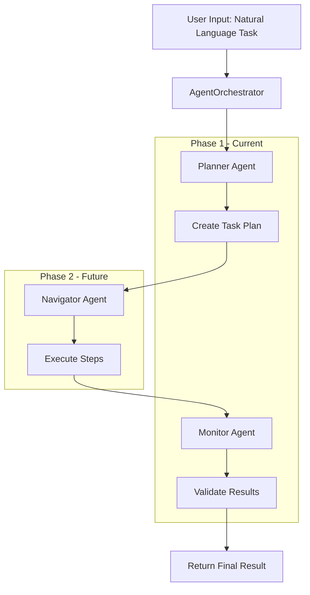
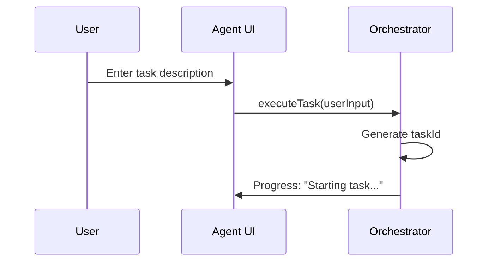
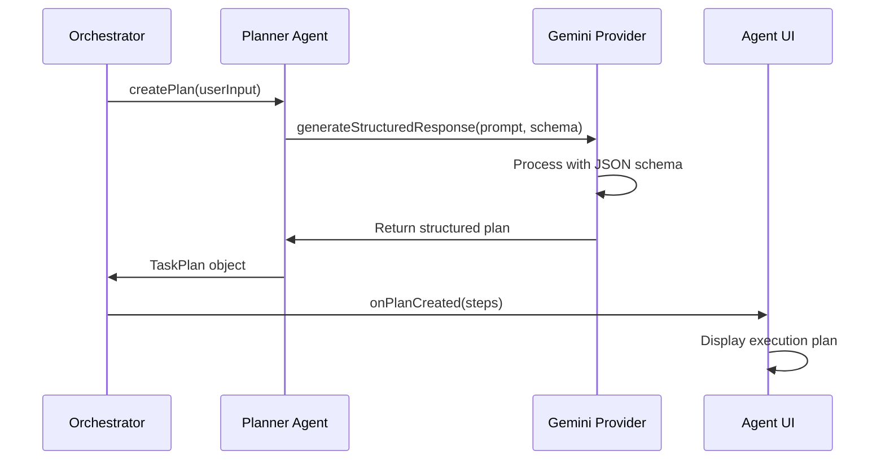
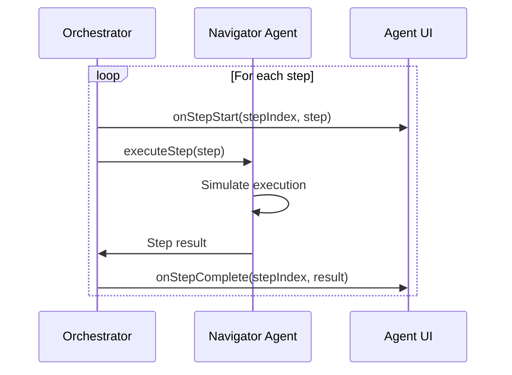
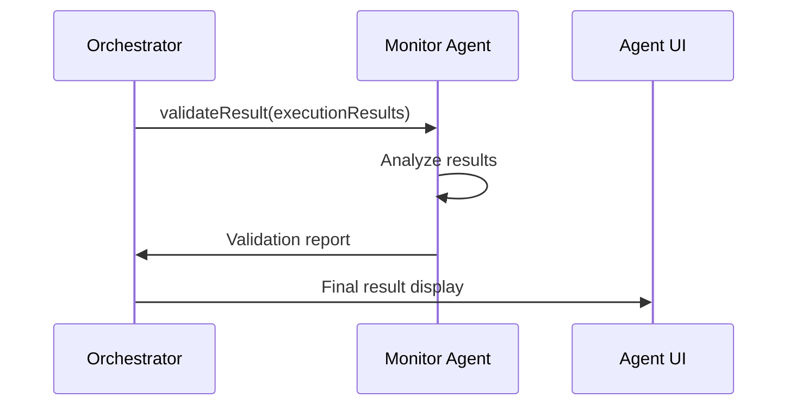
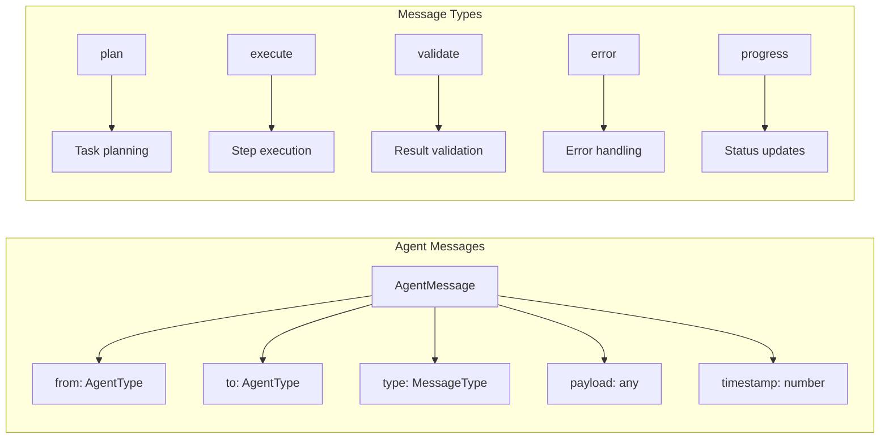
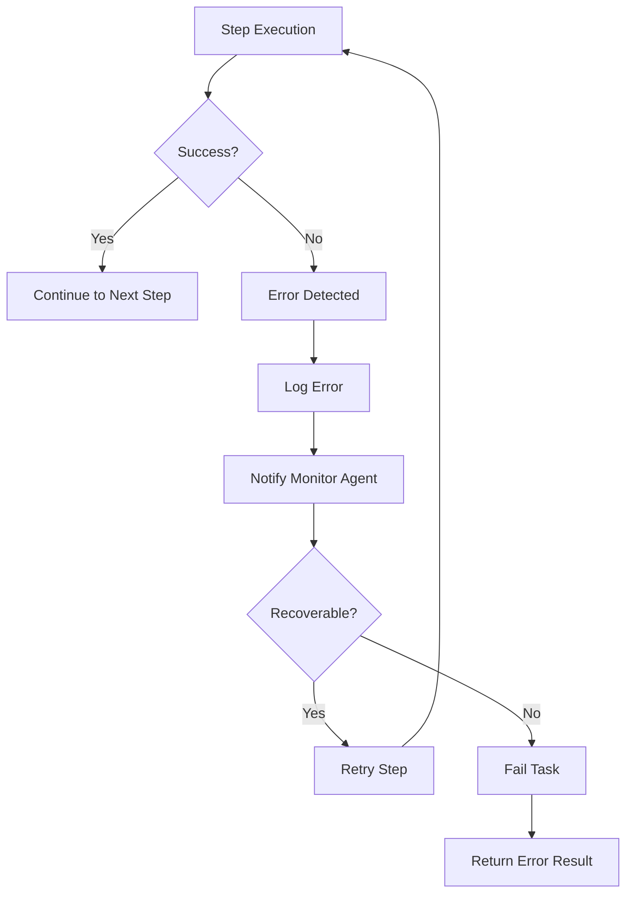
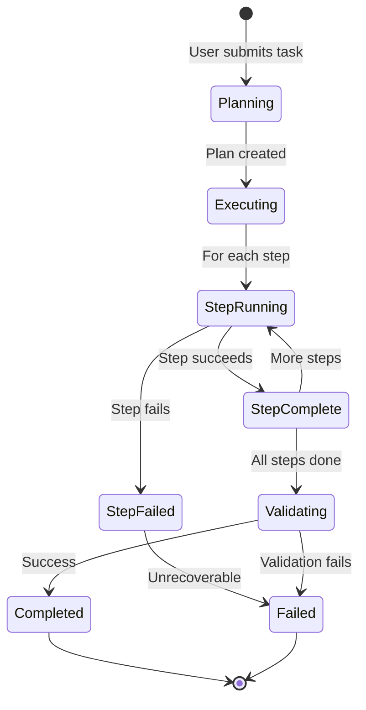
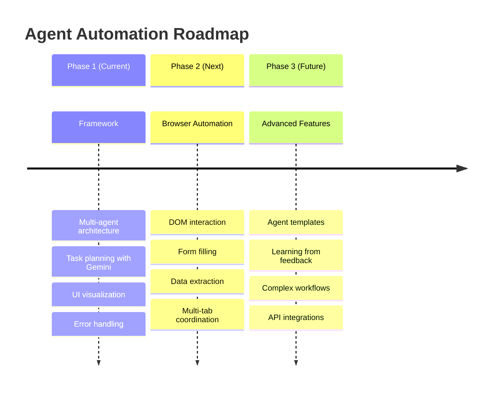

# Delight Agent Automation Workflow

> **Phase 1 Implementation**: Multi-Agent System Architecture and Task Planning

## Overview

Delight's Agent Automation System is a revolutionary multi-agent framework that transforms natural language task descriptions into structured execution plans. This document outlines the complete workflow from user input to task completion.

## Architecture Components

### Core Agents

1. **🧠 Planner Agent** - Task analysis and plan creation
2. **⚡ Navigator Agent** - Step execution and browser interaction  
3. **🔍 Monitor Agent** - Progress tracking and validation

### Supporting Systems

- **AgentOrchestrator** - Coordinates agent communication
- **GeminiProvider** - Structured output for task planning
- **Agent UI** - Real-time progress visualization

## Complete Workflow



## Detailed Agent Workflow

### 1. Task Initiation



### 2. Planning Phase



### 3. Execution Phase (Phase 1)



### 4. Validation Phase



## Task Plan Structure

### JSON Schema for Task Planning

```typescript
interface TaskPlan {
  id: string;
  description: string;
  steps: TaskStep[];
  estimatedDuration: number;
  status: 'planning' | 'executing' | 'completed' | 'failed';
}

interface TaskStep {
  id: string;
  type: 'navigate' | 'click' | 'extract' | 'fill' | 'wait';
  selector?: string;
  url?: string;
  data?: any;
  description: string;
  status: 'pending' | 'running' | 'completed' | 'failed';
}
```

### Example Task Plan

```json
{
  "description": "Search for AI news on Google",
  "steps": [
    {
      "id": "step_1",
      "type": "navigate",
      "url": "https://google.com",
      "description": "Navigate to Google homepage"
    },
    {
      "id": "step_2", 
      "type": "fill",
      "selector": "input[name='q']",
      "data": "AI news",
      "description": "Enter search query"
    },
    {
      "id": "step_3",
      "type": "click", 
      "selector": "input[type='submit']",
      "description": "Submit search"
    }
  ],
  "estimatedDuration": 5000
}
```

## Agent Communication Protocol



## Error Handling & Recovery



## UI Progress Visualization

### Real-time Status Updates



### Log Entry Types

- **🧠 Planner**: Task analysis and plan creation
- **⚡ Navigator**: Step execution updates  
- **🔍 Monitor**: Progress tracking and validation
- **ℹ️ System**: General system messages
- **✅ Success**: Completed operations
- **❌ Error**: Failed operations

## Phase 2 Roadmap

### Planned Enhancements



### Browser Automation Capabilities

- **DOM Interaction**: Click, type, scroll, hover
- **Form Handling**: Fill forms, select options, upload files
- **Data Extraction**: Scrape content, parse structured data
- **Navigation**: Multi-tab coordination, page transitions
- **Validation**: Screenshot comparison, content verification

## Technical Implementation

### Key Files

```
src/services/agents/
├── AgentOrchestrator.ts     # Main coordination
├── PlannerAgent.ts          # Task planning
├── NavigatorAgent.ts        # Browser automation
├── MonitorAgent.ts          # Progress tracking
└── types/
    ├── AgentTypes.ts        # Type definitions
    └── TaskTypes.ts         # Task schemas

src/components/Agent/
├── AgentPage.tsx            # Main UI component
└── AgentInterface.tsx       # Progress visualization

src/services/ai/providers/
└── GeminiProvider.ts        # Structured output support
```

### Performance Considerations

- **Async Operations**: All agent communication is asynchronous
- **Error Boundaries**: Comprehensive error handling at each level
- **Memory Management**: Efficient task plan storage and cleanup
- **UI Responsiveness**: Non-blocking progress updates

## Security & Privacy

- **Local Execution**: All task planning happens locally
- **No Data Transmission**: Task plans never sent to external servers
- **Secure Storage**: Agent logs stored in Chrome's secure storage
- **Permission Model**: Browser automation requires explicit user consent

---

**Version**: 1.1.1 Phase 1  
**Last Updated**: September 2025  
**Status**: Framework Complete, Browser Automation In Development