# Delight Architecture Diagrams

## Core AI Architecture

## Message Flow Architecture

```mermaid
sequenceDiagram
    participant 👤 User
    participant 🎨 UI
    participant 🧠 AIService
    participant 🔌 Provider
    participant ⚡ VercelSDK
    participant 🤖 AI_API
    
    👤 User->>🎨 UI: Type message + select tool
    🎨 UI->>🧠 AIService: processMessage(text, tool, provider)
    🧠 AIService->>🔌 Provider: getModel(modelName)
    🧠 AIService->>⚡ VercelSDK: streamText(model, messages)
    ⚡ VercelSDK->>🤖 AI_API: HTTP request with streaming
    
    loop Streaming Response
        🤖 AI_API-->>⚡ VercelSDK: Text chunk
        ⚡ VercelSDK-->>🧠 AIService: onChunk(delta)
        🧠 AIService-->>🎨 UI: updateMessage(chunk)
        🎨 UI-->>👤 User: Display streaming text
    end
    
    🤖 AI_API-->>⚡ VercelSDK: Stream complete
    ⚡ VercelSDK-->>🧠 AIService: onComplete()
    🧠 AIService-->>🎨 UI: messageComplete()
    🎨 UI-->>👤 User: Show copy/retry buttons
```

## Chrome Extension Integration

```mermaid
graph LR
    subgraph "🌐 Chrome Browser"
        subgraph "🔧 Extension Context"
            BG[Background Script<br/>Service Worker]
            SP[Sidepanel<br/>React App]
            CS[Content Script<br/>Page Access]
            Popup[Popup<br/>Quick Access]
        end
        
        subgraph "📄 Active Tab"
            DOM[Page DOM<br/>Elements]
            Content[Page Content<br/>Text & Images]
        end
        
        subgraph "💾 Browser Storage"
            Local[Local Storage<br/>Conversations]
            Sync[Sync Storage<br/>Settings]
            Session[Session Storage<br/>Temp Data]
        end
    end
    
    subgraph "☁️ External APIs"
        OpenAI[OpenAI API<br/>GPT Models]
        Claude[Anthropic API<br/>Claude Models]
        Gemini[Google API<br/>Gemini Models]
    end
    
    SP <--> BG
    BG <--> CS
    CS <--> DOM
    CS <--> Content
    BG <--> Local
    BG <--> Sync
    SP <--> Session
    
    BG --> OpenAI
    BG --> Claude
    BG --> Gemini
    
    style BG fill:#e3f2fd
    style SP fill:#e8f5e8
    style CS fill:#fff3e0
    style OpenAI fill:#f3e5f5
    style Claude fill:#e1f5fe
    style Gemini fill:#e8f5e8
```

## Performance & Memory Management

```mermaid
graph TD
    subgraph "📊 Performance Layer"
        PM[Performance Monitor<br/>Real-time Metrics]
        PO[Performance Optimizer<br/>Auto Triggers]
        Metrics[Memory Usage<br/>Response Times]
    end
    
    subgraph "💬 Conversation Management"
        CM[Conversation Manager<br/>Session Handling]
        MS[Message Store<br/>Efficient Storage]
        LL[Lazy Loading<br/>On-demand Loading]
    end
    
    subgraph "🗜️ Memory Optimization"
        Compress[Message Compression<br/>Web Worker]
        Cleanup[Auto Cleanup<br/>Age-based Deletion]
        Cache[Smart Caching<br/>LRU Eviction]
    end
    
    subgraph "⚡ Real-time Features"
        Stream[Streaming UI<br/>Smooth Updates]
        Context[Context Optimization<br/>Token Management]
        Fallback[Provider Fallback<br/>Error Recovery]
    end
    
    PM --> Metrics
    PM --> PO
    PO --> CM
    CM --> MS
    MS --> LL
    LL --> Compress
    Compress --> Cleanup
    Cleanup --> Cache
    
    Stream --> Context
    Context --> Fallback
    Fallback --> PM
    
    style PM fill:#e1f5fe
    style CM fill:#e8f5e8
    style Compress fill:#fff3e0
    style Stream fill:#f3e5f5
```

## AI Tools System Architecture

## Page Attachment System

```mermaid
sequenceDiagram
    participant 👤 User
    participant 🎨 UI
    participant 🔧 Background
    participant 📄 ContentScript
    participant 🌐 WebPage
    participant 🧠 AIService
    
    👤 User->>🎨 UI: Click "Attach Page"
    🎨 UI->>🔧 Background: attachCurrentPage()
    🔧 Background->>📄 ContentScript: executeScript(extractContent)
    📄 ContentScript->>🌐 WebPage: Read DOM safely
    🌐 WebPage-->>📄 ContentScript: Page title, URL, text
    📄 ContentScript-->>🔧 Background: Extracted content
    🔧 Background-->>🎨 UI: Page data + preview
    🎨 UI-->>👤 User: Show page card preview
    
    👤 User->>🎨 UI: Send message with attached page
    🎨 UI->>🧠 AIService: processMessage(text, pageContext)
    🧠 AIService->>🧠 AIService: Combine user message + page content
    🧠 AIService->>🤖 AI: Enhanced prompt with context
    🤖 AI-->>🧠 AIService: Contextual response
    🧠 AIService-->>🎨 UI: Stream response
    🎨 UI-->>👤 User: AI understands page context
```

