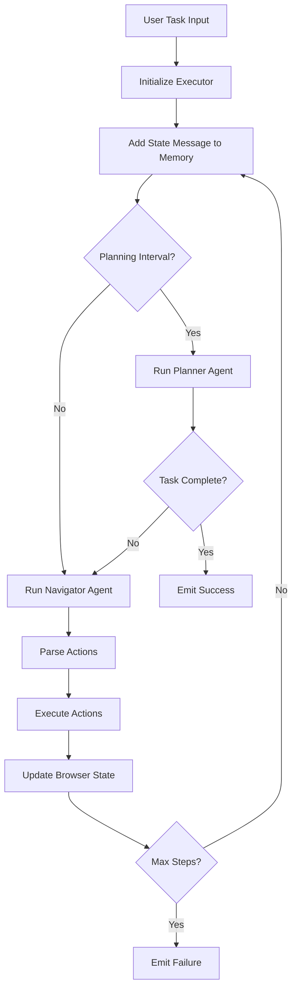
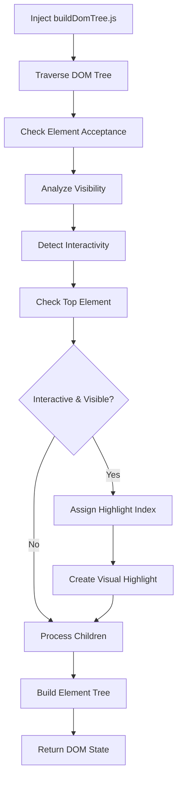
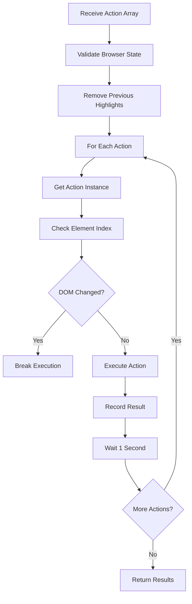

# Nanobrowser Chrome Extension: Browser Automation Architecture Report

## Overview

Nanobrowser implements sophisticated browser automation through a multi-agent AI system that combines Puppeteer, DOM analysis, and LLM-driven decision making. This report details the technical implementation for building similar automation capabilities.

## Architecture Diagram

```
┌─────────────────┐    ┌─────────────────┐    ┌─────────────────┐
│   User Input    │───▶│  Task Manager   │───▶│   Executor      │
└─────────────────┘    └─────────────────┘    └─────────────────┘
                                                       │
                       ┌─────────────────┐    ┌─────────────────┐
                       │  Planner Agent  │◀───┤  Agent Context  │
                       └─────────────────┘    └─────────────────┘
                                │                       │
                       ┌─────────────────┐    ┌─────────────────┐
                       │ Navigator Agent │◀───┤ Browser Context │
                       └─────────────────┘    └─────────────────┘
                                │                       │
                       ┌─────────────────┐    ┌─────────────────┐
                       │ Action Registry │    │  Page Manager   │
                       └─────────────────┘    └─────────────────┘
                                │                       │
                       ┌─────────────────┐    ┌─────────────────┐
                       │ DOM Analyzer    │◀───┤ Puppeteer Core  │
                       └─────────────────┘    └─────────────────┘
```

## Core Components

### 1. Multi-Agent System

#### Planner Agent
- **Purpose**: High-level task planning and completion validation
- **Input**: Task description and current browser state
- **Output**: Strategic guidance and completion status

#### Navigator Agent
- **Purpose**: Executes specific browser actions
- **Input**: Browser state and action instructions
- **Output**: Structured actions to perform

```typescript
// Agent execution flow
export class Executor {
  async execute(): Promise<void> {
    for (step = 0; step < maxSteps; step++) {
      // Run planner periodically for guidance
      if (step % planningInterval === 0) {
        const planOutput = await this.runPlanner();
        if (planOutput?.result?.done) break;
      }
      
      // Execute navigator actions
      const navigatorDone = await this.navigate();
    }
  }
}
```

### 2. Browser Integration Layer

#### Puppeteer Connection
```typescript
// Connect to existing Chrome tab via Extension Transport
const browser = await connect({
  transport: await ExtensionTransport.connectTab(tabId),
  defaultViewport: null,
  protocol: 'cdp' as ProtocolType,
});
```

#### Anti-Detection Scripts
```typescript
await page.evaluateOnNewDocument(`
  // Hide webdriver property
  Object.defineProperty(navigator, 'webdriver', {
    get: () => undefined
  });
  
  // Override permissions API
  const originalQuery = window.navigator.permissions.query;
  window.navigator.permissions.query = (parameters) => (
    parameters.name === 'notifications' ?
      Promise.resolve({ state: Notification.permission }) :
      originalQuery(parameters)
  );
`);
```

### 3. DOM Analysis System

#### Element Detection Pipeline

```javascript
// buildDomTree.js - Core DOM analysis
window.buildDomTree = (args) => {
  const DOM_HASH_MAP = {};
  let highlightIndex = 0;
  
  function buildDomTree(node, parentIframe = null, isParentHighlighted = false) {
    // 1. Fast rejection checks
    if (!isElementAccepted(node)) return null;
    
    // 2. Visibility and interactivity analysis
    const nodeData = {
      tagName: node.tagName.toLowerCase(),
      xpath: getXPathTree(node),
      isVisible: isElementVisible(node),
      isInteractive: isInteractiveElement(node),
      isTopElement: isTopElement(node)
    };
    
    // 3. Highlighting logic
    if (nodeData.isInteractive && shouldHighlight) {
      nodeData.highlightIndex = highlightIndex++;
      highlightElement(node, nodeData.highlightIndex);
    }
    
    return nodeId;
  }
};
```

#### Interactive Element Detection
```javascript
function isInteractiveElement(element) {
  const tagName = element.tagName.toLowerCase();
  const style = getComputedStyle(element);
  
  // Interactive cursors
  const interactiveCursors = new Set([
    'pointer', 'move', 'text', 'grab', 'grabbing'
  ]);
  
  // Check cursor style
  if (style?.cursor && interactiveCursors.has(style.cursor)) {
    return true;
  }
  
  // Interactive tags
  const interactiveElements = new Set([
    'a', 'button', 'input', 'select', 'textarea'
  ]);
  
  return interactiveElements.has(tagName);
}
```

### 4. Visual Highlighting System

#### Element Overlay Creation
```javascript
function highlightElement(element, index) {
  const container = document.getElementById('playwright-highlight-container') || 
    createHighlightContainer();
  
  const rects = element.getClientRects();
  const colors = ['#FF0000', '#00FF00', '#0000FF', '#FFA500'];
  const baseColor = colors[index % colors.length];
  
  // Create overlay for each client rect
  for (const rect of rects) {
    const overlay = document.createElement('div');
    overlay.style.cssText = `
      position: fixed;
      border: 2px solid ${baseColor};
      background: ${baseColor}1A;
      top: ${rect.top}px;
      left: ${rect.left}px;
      width: ${rect.width}px;
      height: ${rect.height}px;
      pointer-events: none;
      z-index: 2147483647;
    `;
    
    container.appendChild(overlay);
  }
  
  // Create numbered label
  const label = document.createElement('div');
  label.textContent = index.toString();
  label.style.cssText = `
    position: fixed;
    background: ${baseColor};
    color: white;
    padding: 1px 4px;
    border-radius: 4px;
    font-size: 12px;
  `;
  
  container.appendChild(label);
}
```

### 5. Action System

#### Action Registry Pattern
```typescript
export class NavigatorActionRegistry {
  private actions: Record<string, Action> = {};
  
  registerAction(action: Action): void {
    this.actions[action.name()] = action;
  }
  
  setupModelOutputSchema(): z.ZodType {
    const actionSchema = buildDynamicActionSchema(Object.values(this.actions));
    return z.object({
      current_state: agentBrainSchema,
      action: z.array(actionSchema),
    });
  }
}
```

#### Core Actions Implementation
```typescript
// Click action example
const clickElement = new Action(
  async (input: { index: number; intent?: string }) => {
    const page = await context.browserContext.getCurrentPage();
    const state = await page.getState();
    const elementNode = state?.selectorMap.get(input.index);
    
    if (!elementNode) {
      throw new Error(`Element ${input.index} not found`);
    }
    
    await page.clickElementNode(context.options.useVision, elementNode);
    return new ActionResult({ 
      extractedContent: `Clicked element ${input.index}`,
      includeInMemory: true 
    });
  },
  clickElementActionSchema,
  true // hasIndex
);
```

### 6. State Management

#### Browser State Structure
```typescript
interface PageState {
  elementTree: DOMElementNode;
  selectorMap: Map<number, DOMElementNode>;
  tabId: number;
  url: string;
  title: string;
  screenshot: string | null;
  scrollY: number;
  scrollHeight: number;
  visualViewportHeight: number;
}
```

#### History Tracking
```typescript
export class AgentStepRecord {
  constructor(
    public modelOutput: string | null,
    public result: ActionResult[],
    public browserStateHistory: BrowserStateHistory
  ) {}
}
```

## Workflow Implementation

### 1. Task Execution Flow



### 2. DOM Analysis Workflow



### 3. Action Execution Workflow



## Key Implementation Details

### 1. Chrome Extension Manifest
```json
{
  "manifest_version": 3,
  "permissions": [
    "activeTab",
    "scripting",
    "webNavigation",
    "storage"
  ],
  "background": {
    "service_worker": "background.js"
  },
  "content_security_policy": {
    "extension_pages": "script-src 'self' 'wasm-unsafe-eval'; object-src 'self';"
  }
}
```

### 2. Script Injection Pattern
```typescript
// Check if script already injected
async function scriptInjectedFrames(tabId: number): Promise<Map<number, boolean>> {
  const results = await chrome.scripting.executeScript({
    target: { tabId, allFrames: true },
    func: () => Object.prototype.hasOwnProperty.call(window, 'buildDomTree'),
  });
  return new Map(results.map(result => [result.frameId, result.result || false]));
}

// Inject DOM analysis script
export async function injectBuildDomTreeScripts(tabId: number) {
  const injectedFrames = await scriptInjectedFrames(tabId);
  
  await chrome.scripting.executeScript({
    target: {
      tabId,
      frameIds: Array.from(injectedFrames.keys()).filter(id => !injectedFrames.get(id)),
    },
    files: ['buildDomTree.js'],
  });
}
```

### 3. LLM Integration Pattern
```typescript
// Structured output with fallback
async invoke(inputMessages: BaseMessage[]): Promise<ModelOutput> {
  if (this.withStructuredOutput) {
    const structuredLlm = this.chatLLM.withStructuredOutput(this.jsonSchema, {
      includeRaw: true,
      name: this.modelOutputToolName,
    });
    
    const response = await structuredLlm.invoke(inputMessages, {
      signal: this.context.controller.signal,
    });
    
    if (response.parsed) {
      return response.parsed;
    }
  }
  
  // Fallback to manual JSON extraction
  return super.invoke(inputMessages);
}
```

## Performance Optimizations

### 1. DOM Caching
```javascript
const DOM_CACHE = {
  boundingRects: new WeakMap(),
  computedStyles: new WeakMap(),
  clearCache: () => {
    DOM_CACHE.boundingRects = new WeakMap();
    DOM_CACHE.computedStyles = new WeakMap();
  }
};
```

### 2. Viewport Filtering
```javascript
function isInExpandedViewport(element, viewportExpansion) {
  if (viewportExpansion === -1) return true;
  
  const rects = element.getClientRects();
  for (const rect of rects) {
    if (!(rect.bottom < -viewportExpansion ||
          rect.top > window.innerHeight + viewportExpansion ||
          rect.right < -viewportExpansion ||
          rect.left > window.innerWidth + viewportExpansion)) {
      return true;
    }
  }
  return false;
}
```

### 3. Element Change Detection
```typescript
// Track DOM changes between actions
const cachedPathHashes = await calcBranchPathHashSet(browserState);
const newPathHashes = await calcBranchPathHashSet(newState);

if (!newPathHashes.isSubsetOf(cachedPathHashes)) {
  // DOM changed, break action sequence
  break;
}
```

## Error Handling & Recovery

### 1. Action Retry Logic
```typescript
async executeHistoryStep(historyItem: AgentStepRecord, maxRetries = 3) {
  let retryCount = 0;
  let success = false;
  
  while (retryCount < maxRetries && !success) {
    try {
      const stepResults = await this.executeHistoryActions(parsedOutput, historyItem);
      success = true;
    } catch (error) {
      retryCount++;
      if (retryCount >= maxRetries && !skipFailures) {
        throw new Error(`Failed after ${maxRetries} attempts`);
      }
      await new Promise(resolve => setTimeout(resolve, 1000));
    }
  }
}
```

### 2. Element Index Updates
```typescript
async updateActionIndices(
  historicalElement: DOMHistoryElement,
  action: Record<string, unknown>,
  currentState: BrowserState
): Promise<Record<string, unknown> | null> {
  const currentElement = await HistoryTreeProcessor.findHistoryElementInTree(
    historicalElement,
    currentState.elementTree
  );
  
  if (!currentElement || currentElement.highlightIndex === null) {
    return null; // Element no longer exists or not interactive
  }
  
  // Update action with new index
  const actionInstance = this.actionRegistry.getAction(actionName);
  actionInstance.setIndexArg(updatedAction[actionName], currentElement.highlightIndex);
  
  return updatedAction;
}
```

## Security Considerations

### 1. Content Security Policy
- Restrict script execution to extension context
- Use `'wasm-unsafe-eval'` for Puppeteer compatibility
- Isolate injected scripts from page context

### 2. Permission Management
- Request minimal required permissions
- Use `activeTab` instead of broad `tabs` permission
- Implement URL allowlist for automation targets

### 3. Anti-Detection Measures
- Override `navigator.webdriver` property
- Modify permission API responses
- Handle shadow DOM access properly

## Available Actions

### Navigation Actions
- `goToUrl` - Navigate to a specific URL
- `goBack` - Go back in browser history
- `searchGoogle` - Perform Google search

### Element Interaction Actions
- `clickElement` - Click on interactive element by index
- `inputText` - Type text into input fields
- `selectDropdownOption` - Select option from dropdown
- `getDropdownOptions` - Get all available dropdown options

### Scrolling Actions
- `scrollToPercent` - Scroll to specific percentage of page
- `scrollToText` - Scroll to find specific text
- `scrollToTop` - Scroll to top of page/element
- `scrollToBottom` - Scroll to bottom of page/element
- `nextPage` - Scroll down one page
- `previousPage` - Scroll up one page

### Tab Management Actions
- `openTab` - Open new tab with URL
- `switchTab` - Switch to specific tab by ID
- `closeTab` - Close specific tab

### Utility Actions
- `wait` - Wait for specified seconds
- `cacheContent` - Store content for later use
- `sendKeys` - Send keyboard shortcuts
- `done` - Mark task as complete

## Implementation Checklist

### Core Infrastructure
- [ ] Chrome extension manifest with required permissions
- [ ] Background service worker setup
- [ ] Puppeteer Core integration with ExtensionTransport
- [ ] Content script injection system

### DOM Analysis
- [ ] buildDomTree.js script for element detection
- [ ] Interactive element identification logic
- [ ] Visual highlighting system
- [ ] XPath generation for element tracking

### Agent System
- [ ] Multi-agent architecture (Planner + Navigator)
- [ ] LLM integration with structured output
- [ ] Action registry and execution system
- [ ] State management and history tracking

### Error Handling
- [ ] Retry logic for failed actions
- [ ] Element index updates for DOM changes
- [ ] Graceful degradation for unsupported sites
- [ ] Anti-detection measures

### Performance
- [ ] DOM caching mechanisms
- [ ] Viewport-based filtering
- [ ] Efficient element change detection
- [ ] Memory management for long-running tasks

This architecture provides a robust foundation for building AI-powered browser automation extensions with sophisticated DOM analysis, visual feedback, and reliable action execution capabilities.