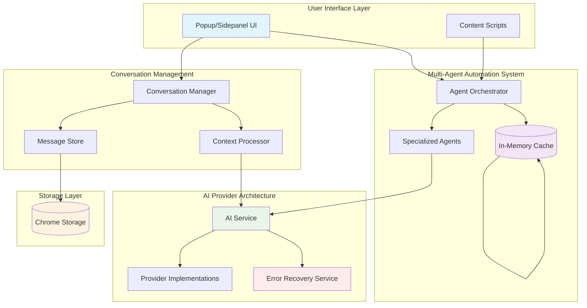

# Delight Chrome Extension - System Documentation

This directory contains comprehensive technical documentation for the Delight Chrome Extension's complex systems. Each system is documented with architectural overviews, visual diagrams, and developer guides.

## System Documentation Structure

### 1. Multi-Agent Automation System
- **Location**: `multi-agent-automation/`
- **Description**: Orchestrates multiple AI agents to perform complex web automation tasks
- **Key Components**: Agent Orchestrator, Agent Memory, Specialized Agents (Planner, Navigator, Monitor, etc.)

### 2. AI Provider Architecture
- **Location**: `ai-provider-architecture/`
- **Description**: Manages multiple AI providers with intelligent switching, error recovery, and fallback mechanisms
- **Key Components**: AI Service, Provider Implementations, Error Recovery Service, Context Processing

### 3. Conversation Management System
- **Location**: `conversation-management/`
- **Description**: Handles chat sessions, message storage, context optimization, and performance monitoring
- **Key Components**: Conversation Manager, Message Store, Context Processor, Performance Optimizer

## Documentation Standards

Each system documentation includes:

1. **Architecture Overview** - High-level system design and component relationships
2. **Sequence Diagrams** - Step-by-step interaction flows using Mermaid syntax
3. **Technical Documentation** - Detailed component descriptions and APIs
4. **Developer Guide** - Implementation guidelines and best practices

## Diagram Conventions

All diagrams use Mermaid syntax and follow these conventions:
- **Blue boxes**: Core system components
- **Green boxes**: External services/APIs
- **Orange boxes**: Storage/persistence layers
- **Red boxes**: Error handling components
- **Purple boxes**: Performance/monitoring components

## Quick Navigation

- [Multi-Agent Automation System](./multi-agent-automation/README.md)
- [AI Provider Architecture](./ai-provider-architecture/README.md)
- [Conversation Management System](./conversation-management/README.md)

## System Integration Map

## Performance Considerations

The systems are designed with performance in mind:
- **Lazy Loading**: Large conversation histories are loaded on-demand
- **Context Optimization**: Automatic token limit management and message truncation
- **Memory Management**: Intelligent caching and cleanup policies
- **Error Recovery**: Robust fallback mechanisms to ensure system reliability

## Development Guidelines

When working with these systems:
1. Follow the established error handling patterns
2. Use the provided interfaces and type definitions
3. Implement proper logging for debugging
4. Consider performance implications of new features
5. Maintain backward compatibility when possible

## Contributing

When adding new features or modifying existing systems:
1. Update the relevant system documentation
2. Add or update Mermaid diagrams as needed
3. Include performance impact analysis
4. Update integration tests
5. Follow the established coding patterns