# AI Provider Architecture

The AI Provider Architecture manages multiple AI service providers with intelligent switching, error recovery, and fallback mechanisms. It provides a unified interface for accessing various AI models while handling provider-specific configurations and limitations.

## System Overview

The architecture follows a provider abstraction pattern with centralized management, automatic failover, and context optimization for different AI providers.

### Core Components

1. **AI Service** - Central service coordinator and provider manager
2. **Base AI Provider** - Abstract base class for provider implementations
3. **Provider Implementations** - Specific implementations for each AI service
4. **Error Recovery Service** - Handles failures and provider switching
5. **Context Processor** - Optimizes context for different providers
6. **Function Manager** - Manages AI function calling capabilities

## Architecture Diagram

```mermaid
graph TB
    subgraph "AI Service Layer"
        AIService[AI Service]
        ConfigManager[Config Manager]
        TrialService[Trial Service]
    end
    
    subgraph "Provider Management"
        BaseProvider[Base AI Provider]
        ErrorRecovery[Error Recovery Service]
        FunctionManager[Function Manager]
    end
    
    subgraph "Provider Implementations"
        OpenAI[OpenAI Provider]
        Anthropic[Anthropic Provider]
        Gemini[Gemini Provider]
        Grok[Grok Provider]
        Groq[Groq Provider]
        SambaNova[SambaNova Provider]
        Ollama[Ollama Provider]
    end
    
    subgraph "Context Management"
        ContextProcessor[Context Processor]
        PromptManager[Prompt Manager]
    end
    
    subgraph "External Services"
        OpenAIAPI[OpenAI API]
        AnthropicAPI[Anthropic API]
        GeminiAPI[Gemini API]
        GrokAPI[Grok API]
        GroqAPI[Groq API]
        SambaNovaAPI[SambaNova API]
        OllamaAPI[Ollama API]
    end
    
    AIService --> ConfigManager
    AIService --> TrialService
    AIService --> ErrorRecovery
    AIService --> ContextProcessor
    
    BaseProvider --> FunctionManager
    BaseProvider --> PromptManager
    
    OpenAI --> BaseProvider
    Anthropic --> BaseProvider
    Gemini --> BaseProvider
    Grok --> BaseProvider
    Groq --> BaseProvider
    SambaNova --> BaseProvider
    Ollama --> BaseProvider
    
    OpenAI --> OpenAIAPI
    Anthropic --> AnthropicAPI
    Gemini --> GeminiAPI
    Grok --> GrokAPI
    Groq --> GroqAPI
    SambaNova --> SambaNovaAPI
    Ollama --> OllamaAPI
    
    style AIService fill:#e3f2fd
    style ErrorRecovery fill:#ffebee
    style ContextProcessor fill:#f3e5f5
    style BaseProvider fill:#e8f5e8
    style OpenAIAPI fill:#fff3e0
```

## Provider Switching Decision Flow

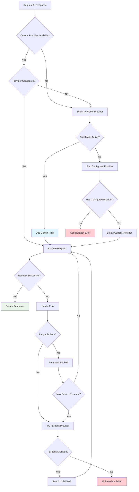

## Error Recovery Cascade

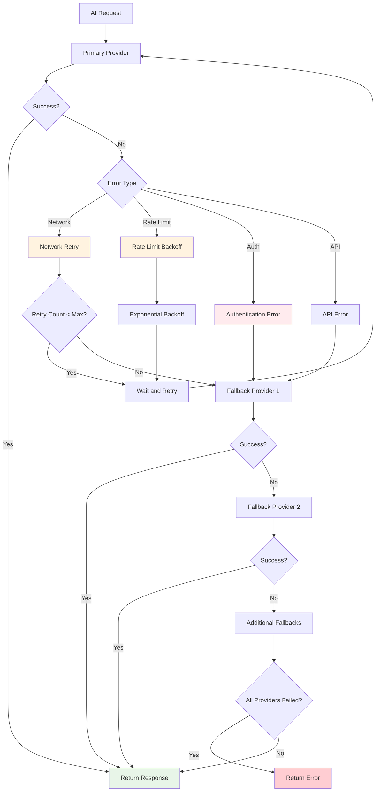

## Message Format Conversion Pipeline

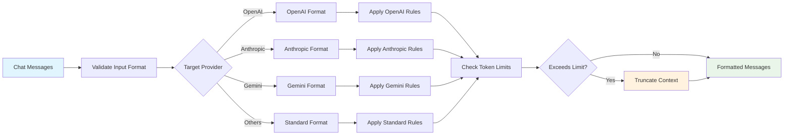

## Provider Selection Logic

### Configuration-Based Selection

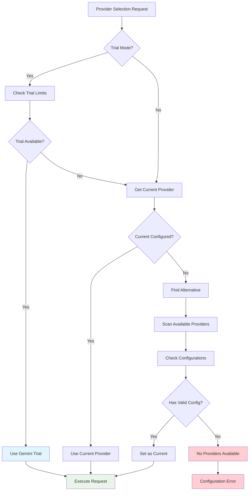

### Capability-Based Selection

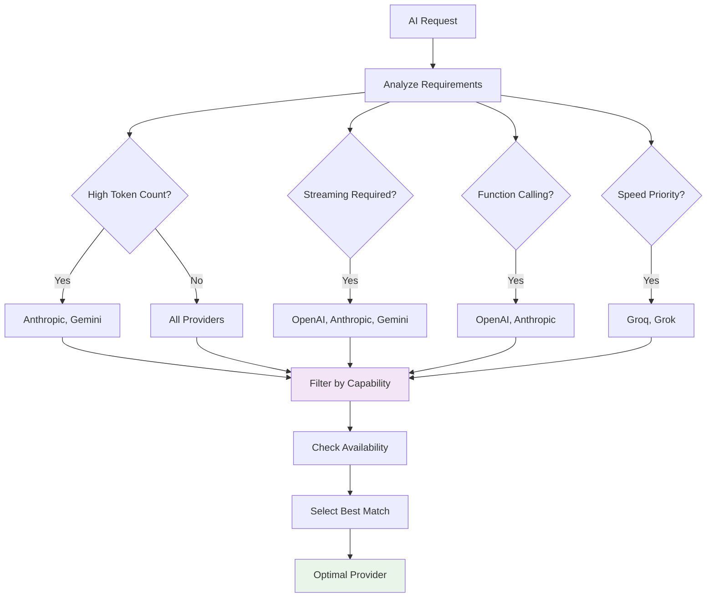

## Context Optimization Strategies

### Token Limit Management

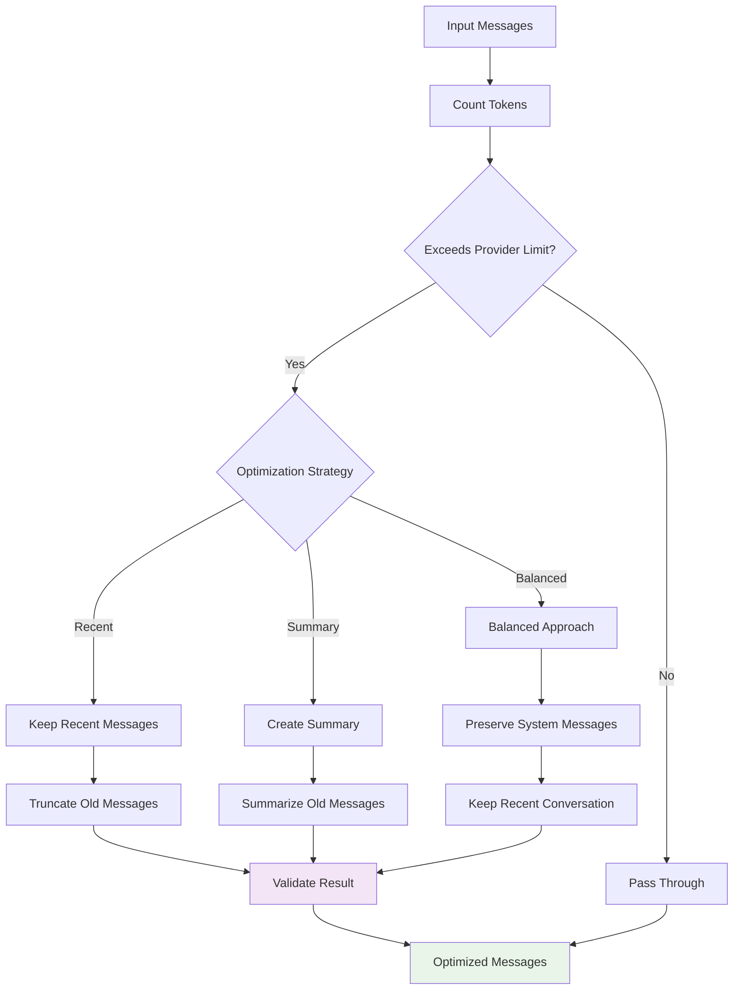

### Provider-Specific Optimization

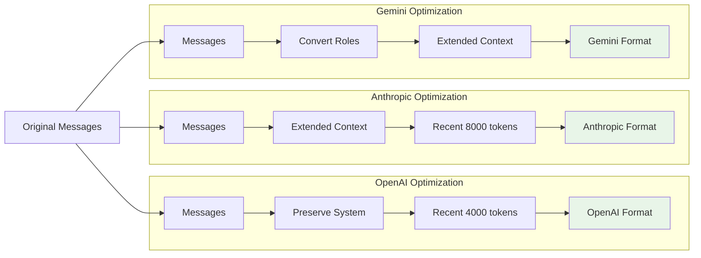

## Performance Monitoring

### Response Time Tracking

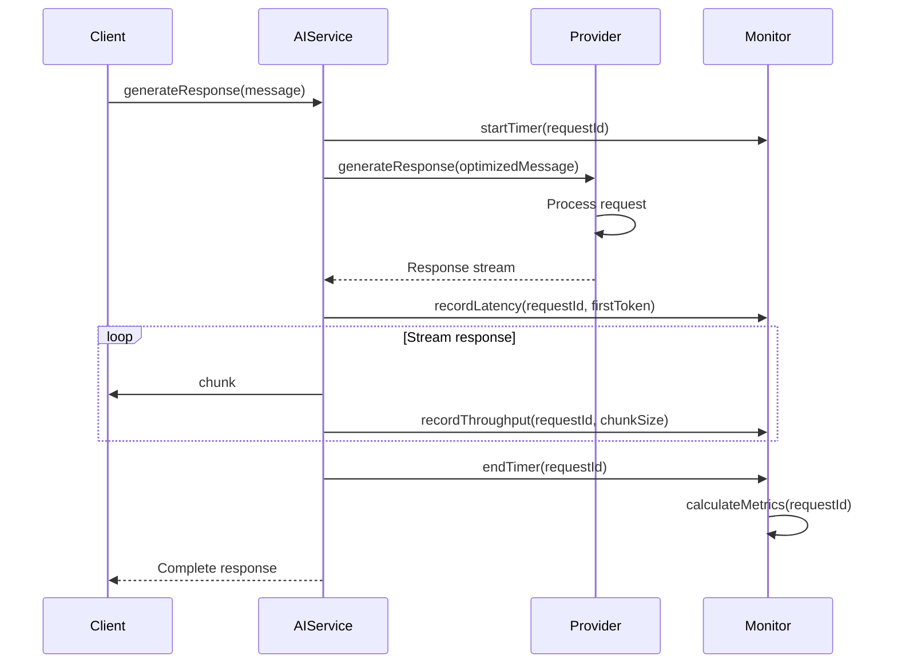

### Error Rate Monitoring

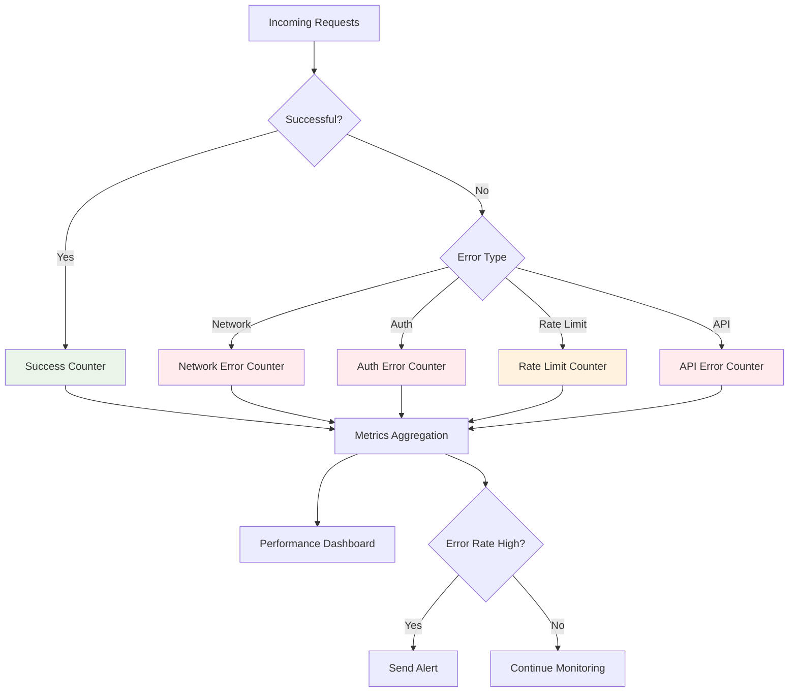

## Configuration Management

### Provider Configuration Flow

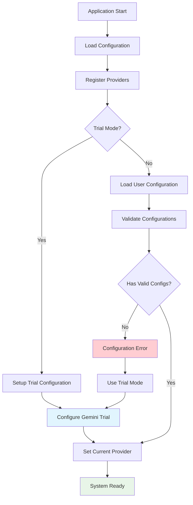

### Dynamic Configuration Updates

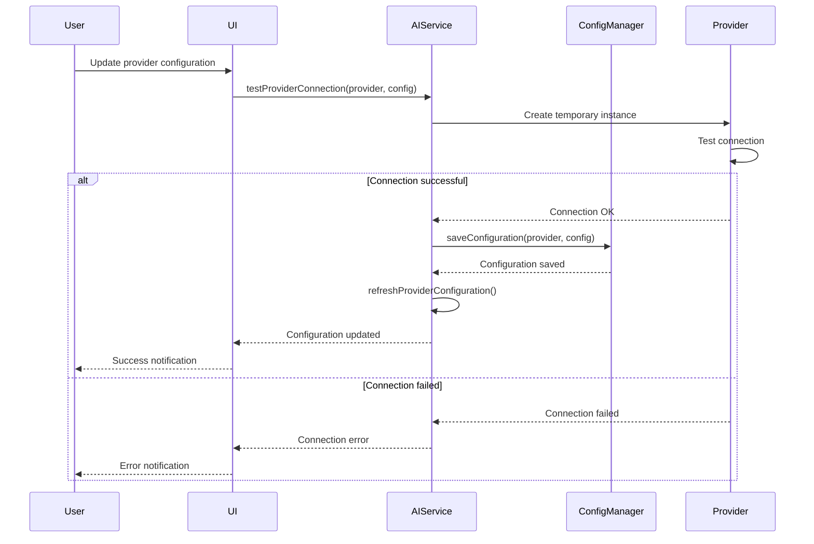

## Integration Points

### Conversation Management Integration

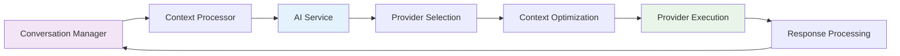

### Agent System Integration

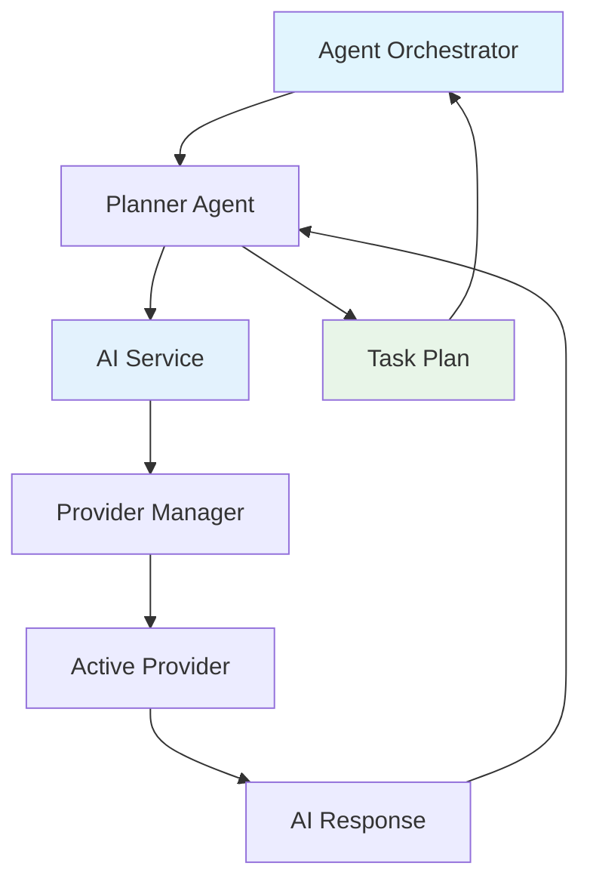

## Best Practices

### Provider Implementation Guidelines

1. **Error Handling**: Implement comprehensive error classification and handling
2. **Rate Limiting**: Respect provider-specific rate limits and implement backoff
3. **Context Optimization**: Optimize message format for each provider's requirements
4. **Streaming Support**: Implement proper streaming response handling
5. **Configuration Validation**: Validate API keys and configuration before use

### Performance Optimization

1. **Connection Pooling**: Reuse connections where possible
2. **Response Caching**: Cache responses for identical requests
3. **Lazy Loading**: Load providers only when needed
4. **Memory Management**: Clean up unused provider instances
5. **Monitoring**: Track performance metrics and error rates

### Security Considerations

1. **API Key Storage**: Secure storage of API keys in Chrome storage
2. **Request Validation**: Validate all requests before sending to providers
3. **Error Information**: Avoid exposing sensitive information in error messages
4. **Network Security**: Use HTTPS for all provider communications
5. **Access Control**: Implement proper access controls for configuration changes

## Related Documentation

- [Multi-Agent Automation System](../multi-agent-automation/README.md)
- [Conversation Management System](../conversation-management/README.md)
- [Error Recovery Patterns](./error-recovery-patterns.md)