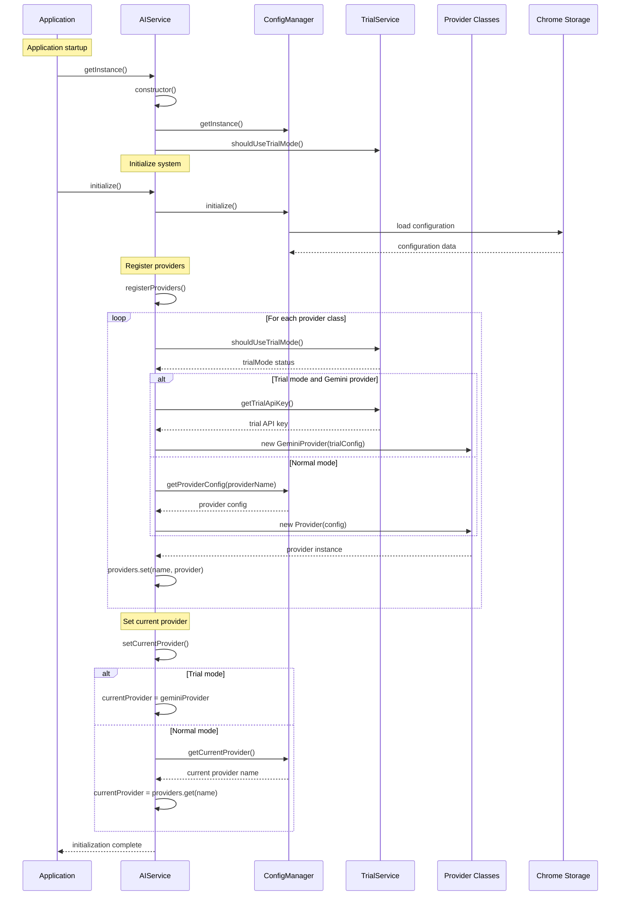
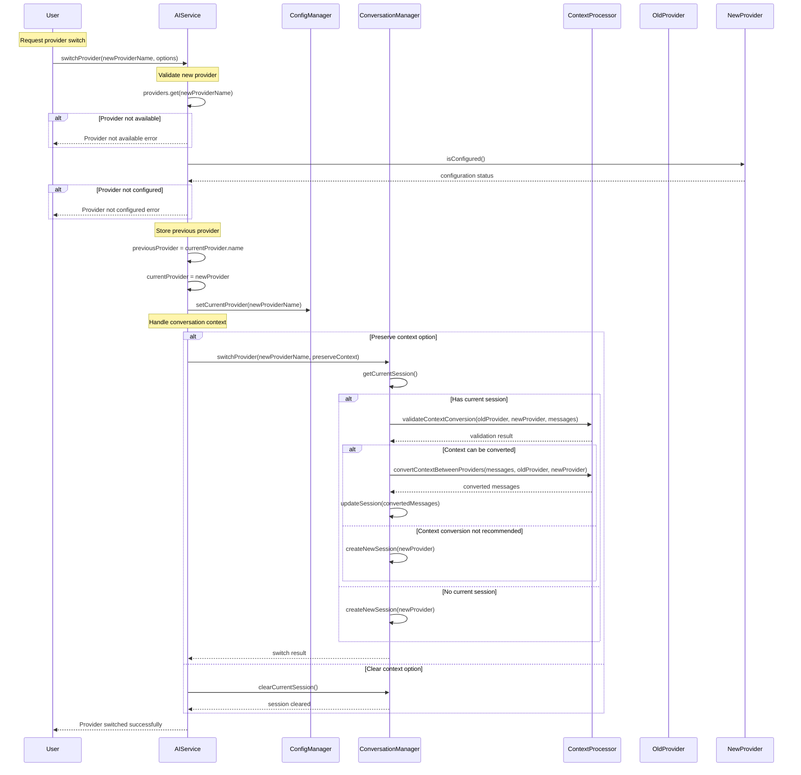
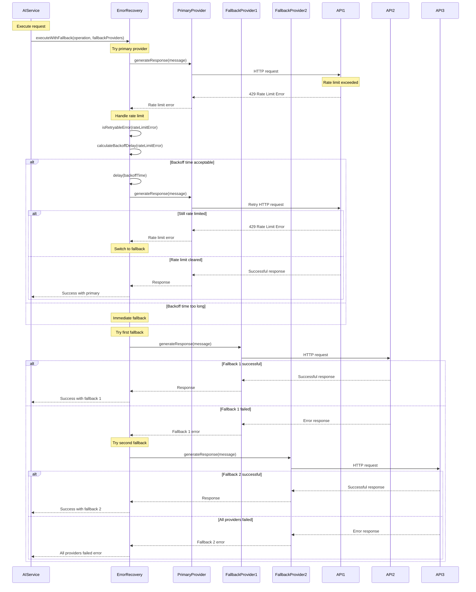
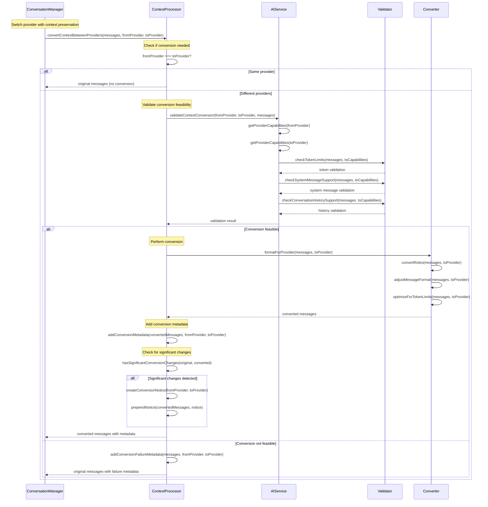
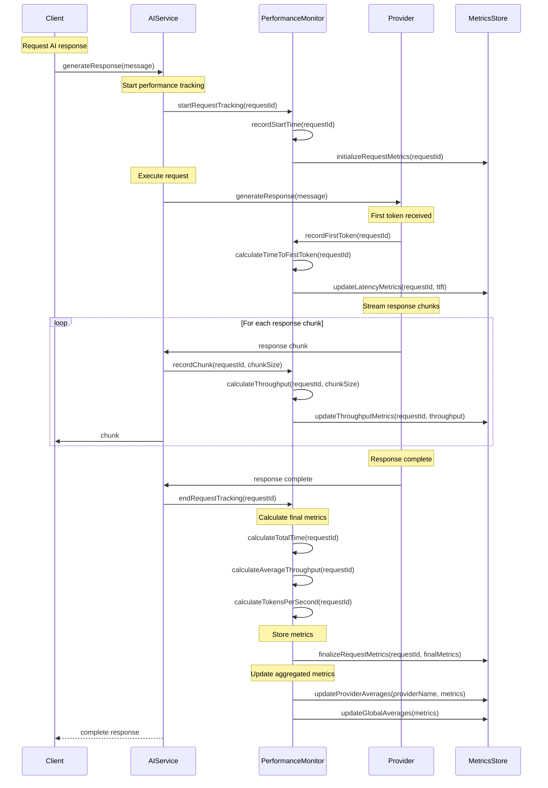
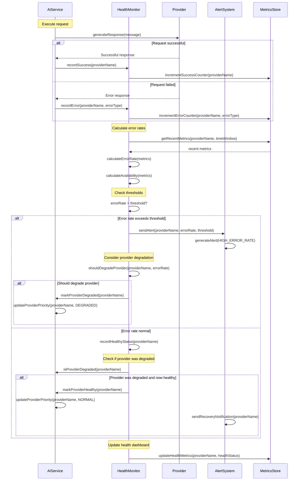
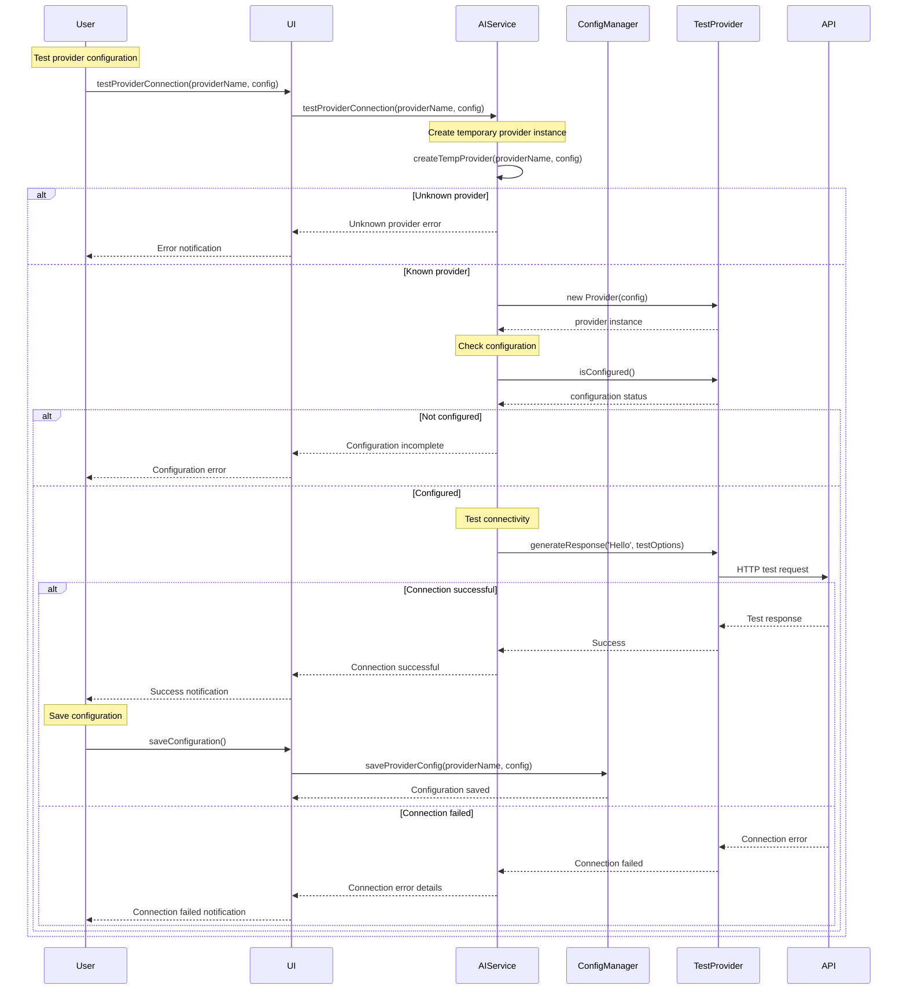
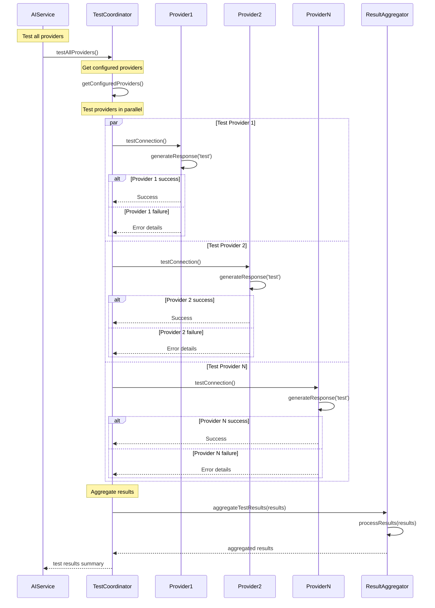

# AI Provider Architecture - Sequence Diagrams

This document contains detailed sequence diagrams showing the interaction patterns within the AI Provider Architecture.

## Provider Initialization and Registration

### System Startup and Provider Registration



## Request Processing Flow

### Chat Response Generation with History

```mermaid
sequenceDiagram
    participant Client
    participant AIService
    participant TrialService
    participant ContextProcessor
    participant ErrorRecovery
    participant Provider
    participant FallbackProvider
    participant API as External API
    
    Note over Client: Request chat response
    Client->>AIService: generateChatResponseWithHistory(messages, onChunk)
    
    Note over AIService: Check trial limits
    AIService->>TrialService: shouldUseTrialMode()
    TrialService-->>AIService: trial status
    
    alt Trial mode active
        AIService->>TrialService: getRemainingTrialRequests()
        TrialService-->>AIService: remaining requests
        
        alt No requests remaining
            AIService-->>Client: Trial limit exceeded error
        else Requests available
            AIService->>TrialService: incrementTrialUsage()
        end
    end
    
    Note over AIService: Validate provider
    AIService->>AIService: validateCurrentProvider()
    
    alt Provider not configured
        AIService-->>Client: Configuration error
    end
    
    Note over AIService: Optimize context
    AIService->>ContextProcessor: getProviderTokenLimit(providerName)
    ContextProcessor-->>AIService: token limit
    AIService->>ContextProcessor: optimizeContext(messages, maxTokens)
    ContextProcessor-->>AIService: optimized messages
    
    Note over AIService: Format for provider
    AIService->>ContextProcessor: formatForProvider(messages, providerName)
    ContextProcessor-->>AIService: provider messages
    
    Note over AIService: Validate format
    AIService->>ContextProcessor: validateMessageFormat(messages, providerName)
    ContextProcessor-->>AIService: validation result
    
    alt Invalid format
        AIService-->>Client: Invalid message format error
    end
    
    Note over AIService: Execute with fallback
    AIService->>ErrorRecovery: executeWithFallback(primaryOperation, fallbackProviders, 'chat', data)
    
    Note over ErrorRecovery: Try primary provider
    ErrorRecovery->>ErrorRecovery: executeWithRetry(primaryOperation)
    
    loop Retry attempts (max 3)
        ErrorRecovery->>Provider: generateResponseWithHistory(messages, options)
        Provider->>API: HTTP request
        
        alt Request successful
            API-->>Provider: Response stream
            
            loop Stream chunks
                Provider->>Provider: process chunk
                Provider-->>ErrorRecovery: chunk
                ErrorRecovery-->>AIService: chunk
                AIService->>Client: onChunk(chunk)
            end
            
            Provider-->>ErrorRecovery: complete response
            break Success - exit retry loop
        else Request failed
            API-->>Provider: Error response
            Provider-->>ErrorRecovery: Provider error
            
            ErrorRecovery->>ErrorRecovery: isRetryableError(error)
            
            alt Retryable error
                ErrorRecovery->>ErrorRecovery: calculateBackoffDelay(attempt)
                ErrorRecovery->>ErrorRecovery: delay(backoffTime)
                Note over ErrorRecovery: Continue retry loop
            else Non-retryable error
                break Exit retry loop with error
            end
        end
    end
    
    alt Primary provider failed
        Note over ErrorRecovery: Try fallback providers
        loop For each fallback provider
            ErrorRecovery->>FallbackProvider: generateResponseWithHistory(messages, options)
            FallbackProvider->>API: HTTP request
            
            alt Fallback successful
                API-->>FallbackProvider: Response stream
                FallbackProvider-->>ErrorRecovery: response
                ErrorRecovery-->>AIService: {result, usedProvider}
                break Success with fallback
            else Fallback failed
                API-->>FallbackProvider: Error
                FallbackProvider-->>ErrorRecovery: Fallback error
                Note over ErrorRecovery: Try next fallback
            end
        end
        
        alt All providers failed
            ErrorRecovery-->>AIService: All providers failed error
        end
    else Primary provider succeeded
        ErrorRecovery-->>AIService: {result, usedProvider: null}
    end
    
    AIService-->>Client: Final response
```

### Provider Switching with Context Preservation



## Error Recovery Sequences

### Network Error Recovery with Exponential Backoff

```mermaid
sequenceDiagram
    participant AIService
    participant ErrorRecovery
    participant NetworkMonitor
    participant Provider
    participant API
    
    Note over AIService: Execute request
    AIService->>ErrorRecovery: executeWithRetry(operation)
    
    loop Retry attempts (max 3)
        Note over ErrorRecovery: Check network connectivity
        ErrorRecovery->>NetworkMonitor: checkNetworkConnectivity()
        NetworkMonitor->>NetworkMonitor: fetch('https://www.google.com/favicon.ico')
        
        alt Network available
            NetworkMonitor-->>ErrorRecovery: network online
            
            ErrorRecovery->>Provider: generateResponse(message)
            Provider->>API: HTTP request
            
            alt Network error during request
                API-->>Provider: Network timeout/error
                Provider-->>ErrorRecovery: Network error
                
                ErrorRecovery->>ErrorRecovery: isRetryableError(networkError)
                ErrorRecovery->>ErrorRecovery: calculateBackoffDelay(attempt)
                
                Note over ErrorRecovery: Exponential backoff delay
                ErrorRecovery->>ErrorRecovery: delay(backoffTime)
                
                Note over ErrorRecovery: Continue retry loop
            else Request successful
                API-->>Provider: Successful response
                Provider-->>ErrorRecovery: Response
                ErrorRecovery-->>AIService: Success
                break Exit retry loop
            end
        else Network unavailable
            NetworkMonitor-->>ErrorRecovery: network offline
            ErrorRecovery-->>AIService: Network unavailable error
            break Exit with network error
        end
    end
    
    alt Max retries exceeded
        ErrorRecovery-->>AIService: Max retries exceeded error
    end
```

### Rate Limit Handling with Provider Fallback



## Context Processing Sequences

### Message Format Conversion and Optimization

```mermaid
sequenceDiagram
    participant AIService
    participant ContextProcessor
    participant TokenCounter
    participant MessageFormatter
    participant Optimizer
    
    Note over AIService: Process messages for provider
    AIService->>ContextProcessor: formatForProvider(messages, providerName)
    
    Note over ContextProcessor: Calculate current token count
    ContextProcessor->>TokenCounter: calculateTokenCount(messages)
    TokenCounter->>TokenCounter: estimate tokens from character count
    TokenCounter-->>ContextProcessor: current token count
    
    Note over ContextProcessor: Check provider limits
    ContextProcessor->>ContextProcessor: getProviderTokenLimit(providerName)
    
    alt Token count exceeds limit
        Note over ContextProcessor: Optimize context
        ContextProcessor->>Optimizer: optimizeContext(messages, maxTokens)
        
        Optimizer->>Optimizer: identifySystemMessages(messages)
        Optimizer->>Optimizer: identifyConversationMessages(messages)
        
        Note over Optimizer: Calculate token allocation
        Optimizer->>TokenCounter: calculateTokenCount(systemMessages)
        TokenCounter-->>Optimizer: system message tokens
        
        Optimizer->>Optimizer: availableTokens = maxTokens - systemTokens
        
        Note over Optimizer: Truncate conversation messages
        Optimizer->>Optimizer: truncateMessages(conversationMessages, availableTokens)
        
        loop From most recent backwards
            Optimizer->>TokenCounter: calculateTokenCount([message])
            TokenCounter-->>Optimizer: message tokens
            
            alt Fits in remaining space
                Optimizer->>Optimizer: include message
            else Exceeds remaining space
                Optimizer->>Optimizer: truncateMessage(message, remainingTokens)
                break Stop including messages
            end
        end
        
        Optimizer-->>ContextProcessor: optimized messages
    else Token count within limit
        ContextProcessor->>ContextProcessor: use original messages
    end
    
    Note over ContextProcessor: Format for specific provider
    ContextProcessor->>MessageFormatter: formatForProvider(messages, providerName)
    
    MessageFormatter->>MessageFormatter: switch(providerName)
    
    alt OpenAI format
        MessageFormatter->>MessageFormatter: formatForOpenAI(messages)
    else Anthropic format
        MessageFormatter->>MessageFormatter: formatForAnthropic(messages)
    else Gemini format
        MessageFormatter->>MessageFormatter: formatForGemini(messages)
        Note over MessageFormatter: Convert 'assistant' to 'model' for Gemini
    else Other providers
        MessageFormatter->>MessageFormatter: formatForStandard(messages)
    end
    
    MessageFormatter-->>ContextProcessor: formatted messages
    
    Note over ContextProcessor: Validate format
    ContextProcessor->>ContextProcessor: validateMessageFormat(formattedMessages, providerName)
    
    ContextProcessor-->>AIService: provider-ready messages
```

### Context Conversion Between Providers



## Performance Monitoring Sequences

### Response Time and Throughput Tracking



### Error Rate and Health Monitoring



## Configuration and Testing Sequences

### Provider Configuration Testing



### Bulk Provider Testing



These sequence diagrams provide comprehensive views of the AI Provider Architecture's interaction patterns, showing how components coordinate to provide reliable AI services with robust error handling and performance monitoring.