# Conversation Management System

The Conversation Management System handles chat sessions, message storage, context optimization, and performance monitoring. It provides persistent conversation history, intelligent context management, and seamless provider switching while maintaining conversation continuity.

## System Overview

The system follows a layered architecture with conversation management at the top, message storage in the middle, and performance optimization throughout all layers.

### Core Components

1. **Conversation Manager** - High-level conversation orchestration and session management
2. **Message Store** - Persistent storage and retrieval of messages and sessions
3. **Context Processor** - Message optimization and provider-specific formatting
4. **Performance Optimizer** - Memory management and performance monitoring
5. **Performance Monitor** - Real-time performance tracking and optimization

## Architecture Diagram

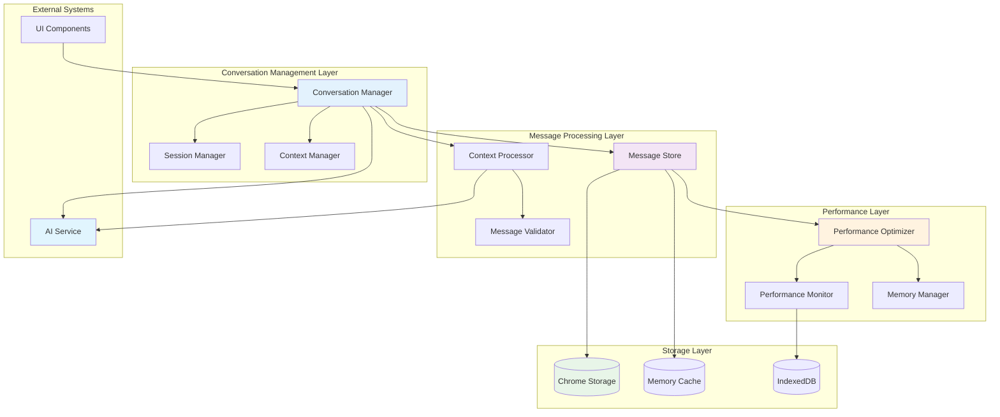

## Message Lifecycle Flow

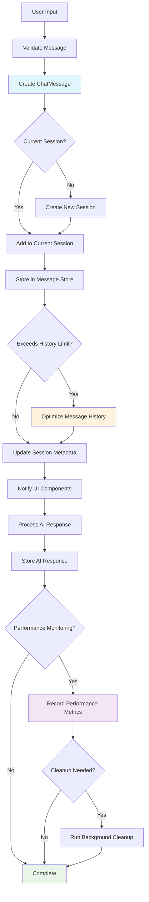

## Context Optimization Workflow

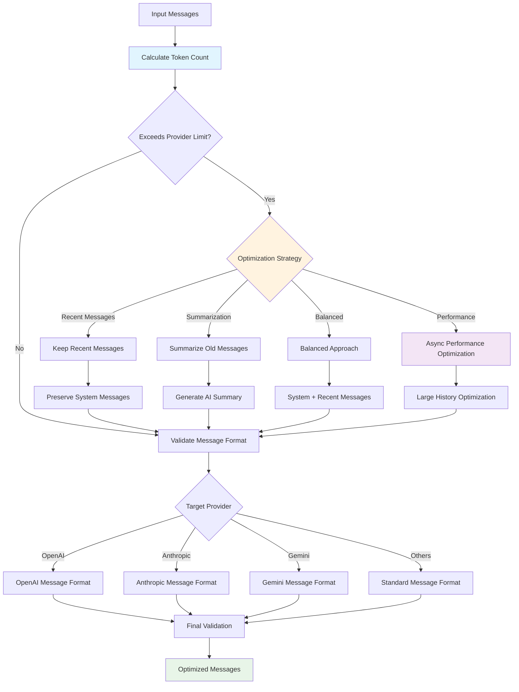

## Performance Monitoring Architecture

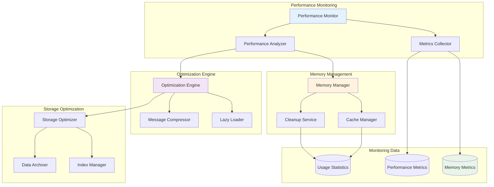

## Session Management Patterns

### Session Creation and Lifecycle

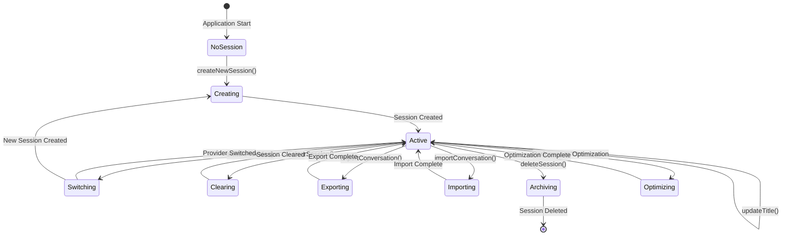

### Provider Switching Decision Tree

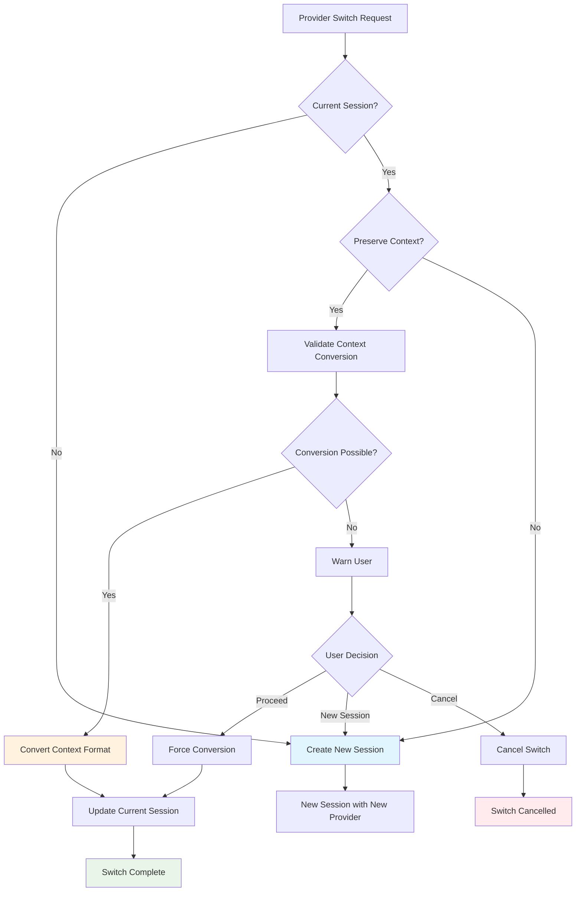

## Storage Cleanup Algorithms

### Intelligent Cleanup Strategy

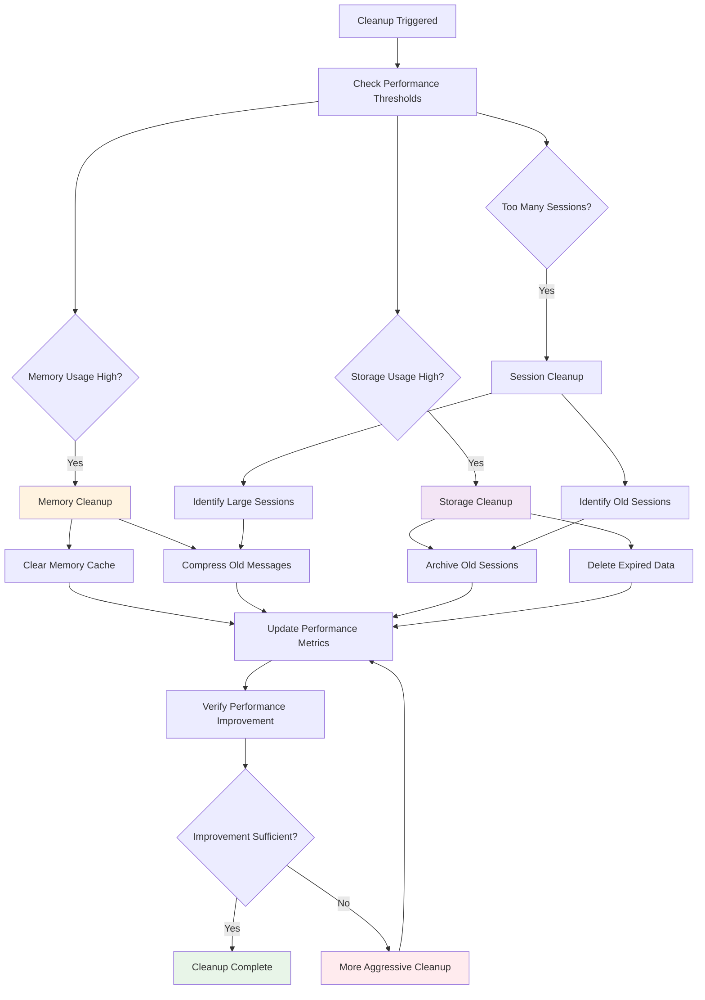

### Compression Algorithm Flow

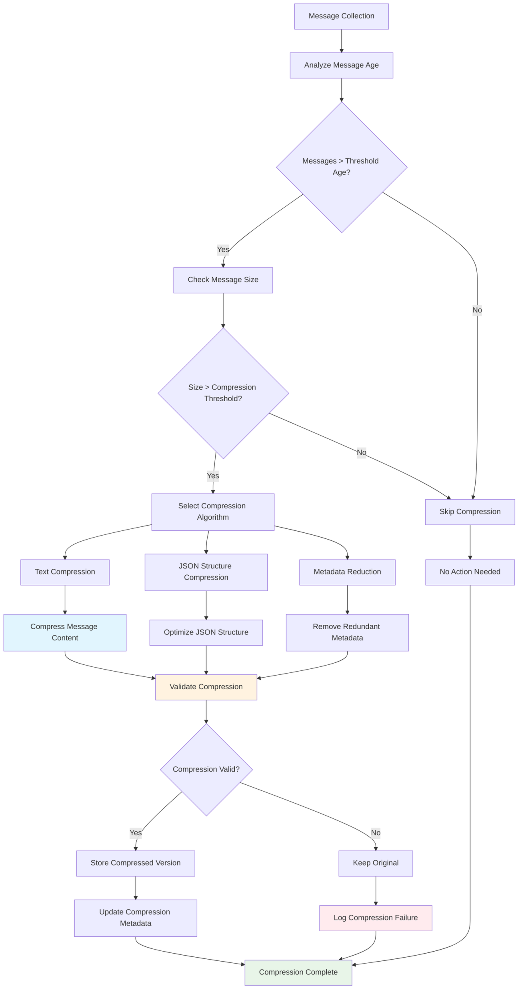

## Integration Patterns

### AI Service Integration

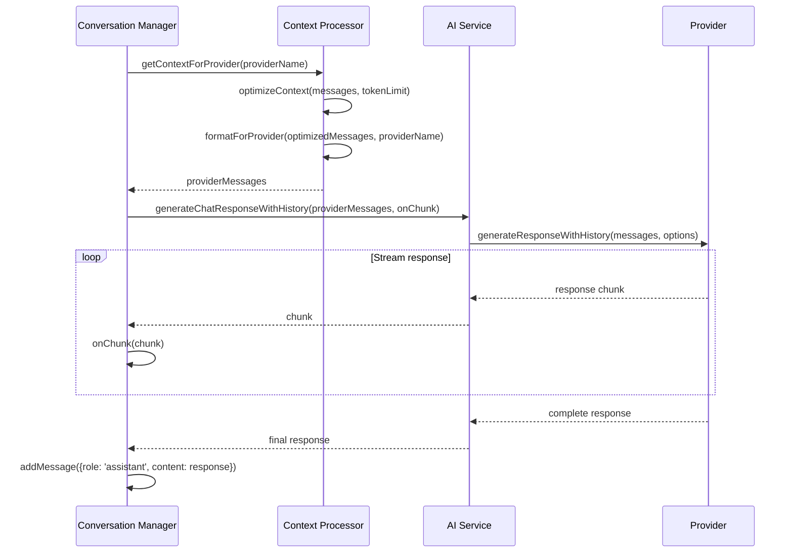

### Performance Optimization Integration

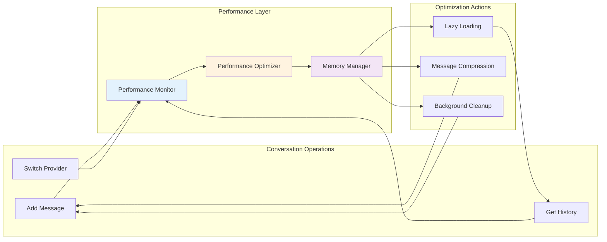

## Error Handling Strategies

### Storage Error Recovery

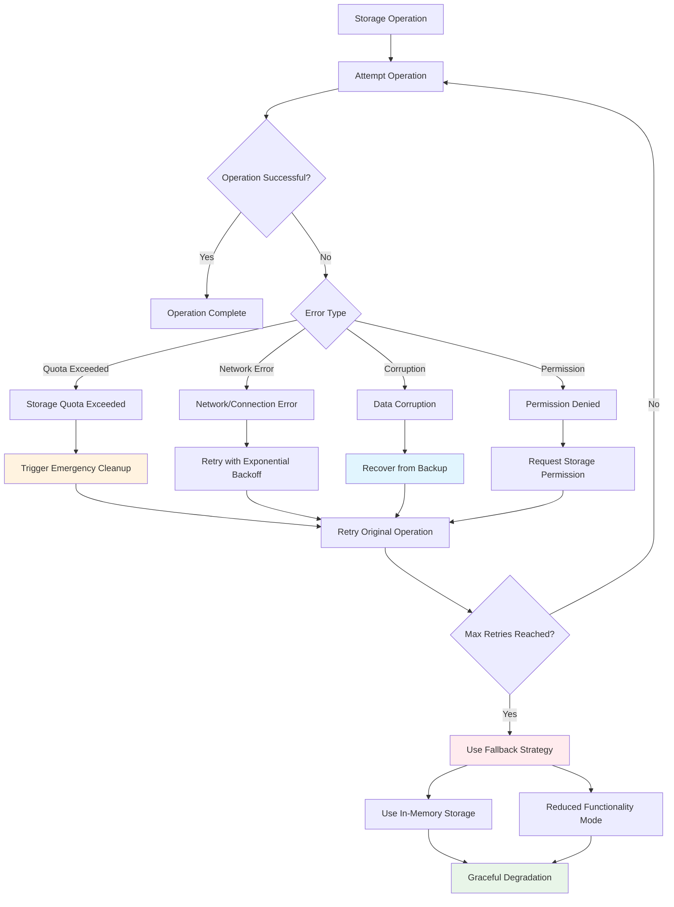

### Context Processing Error Handling

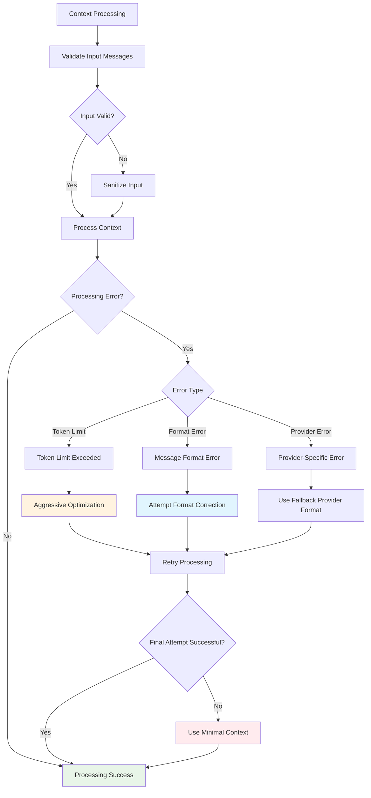

## Performance Metrics and Monitoring

### Key Performance Indicators

```mermaid
graph TB
    subgraph "Response Time Metrics"
        MessageLatency[Message Processing Latency]
        ContextOptimization[Context Optimization Time]
        StorageLatency[Storage Operation Latency]
    end
    
    subgraph "Memory Metrics"
        MemoryUsage[Memory Usage]
        CacheHitRate[Cache Hit Rate]
        SessionCount[Active Session Count]
    end
    
    subgraph "Storage Metrics"
        StorageUsage[Storage Space Usage]
        CompressionRatio[Compression Ratio]
        CleanupFrequency[Cleanup Frequency]
    end
    
    subgraph "User Experience Metrics"
        MessageThroughput[Message Throughput]
        ErrorRate[Error Rate]
        ProviderSwitchTime[Provider Switch Time]
    end
    
    subgraph "Performance Dashboard"
        RealTimeMonitor[Real-time Monitor]
        AlertSystem[Alert System]
        PerformanceReports[Performance Reports]
    end
    
    MessageLatency --> RealTimeMonitor
    ContextOptimization --> RealTimeMonitor
    StorageLatency --> RealTimeMonitor
    
    MemoryUsage --> AlertSystem
    CacheHitRate --> AlertSystem
    SessionCount --> AlertSystem
    
    StorageUsage --> PerformanceReports
    CompressionRatio --> PerformanceReports
    CleanupFrequency --> PerformanceReports
    
    MessageThroughput --> RealTimeMonitor
    ErrorRate --> AlertSystem
    ProviderSwitchTime --> PerformanceReports
    
    style RealTimeMonitor fill:#e3f2fd
    style AlertSystem fill:#ffebee
    style PerformanceReports fill:#e8f5e8
```

## Best Practices

### Message Management
1. **Efficient Storage**: Use compression for old messages to reduce storage usage
2. **Context Optimization**: Implement intelligent truncation strategies for different providers
3. **Memory Management**: Use lazy loading for large conversation histories
4. **Error Recovery**: Implement graceful degradation for storage failures

### Performance Optimization
1. **Lazy Loading**: Load conversation history on-demand to reduce initial load time
2. **Background Cleanup**: Run cleanup operations during idle periods
3. **Compression**: Compress old messages to save storage space
4. **Caching**: Cache frequently accessed sessions in memory

### Provider Integration
1. **Context Conversion**: Handle provider-specific message format requirements
2. **Token Management**: Respect provider token limits with intelligent optimization
3. **Error Handling**: Implement provider-specific error recovery strategies
4. **Performance Monitoring**: Track provider-specific performance metrics

### User Experience
1. **Seamless Switching**: Provide smooth provider switching with context preservation
2. **Progress Feedback**: Show progress during long operations
3. **Error Communication**: Provide clear error messages and recovery options
4. **Data Export**: Allow users to export their conversation history

## Related Documentation

- [Multi-Agent Automation System](../multi-agent-automation/README.md)
- [AI Provider Architecture](../ai-provider-architecture/README.md)
- [Performance Optimization Guide](./performance-optimization.md)
- [Storage Management Guide](./storage-management.md)