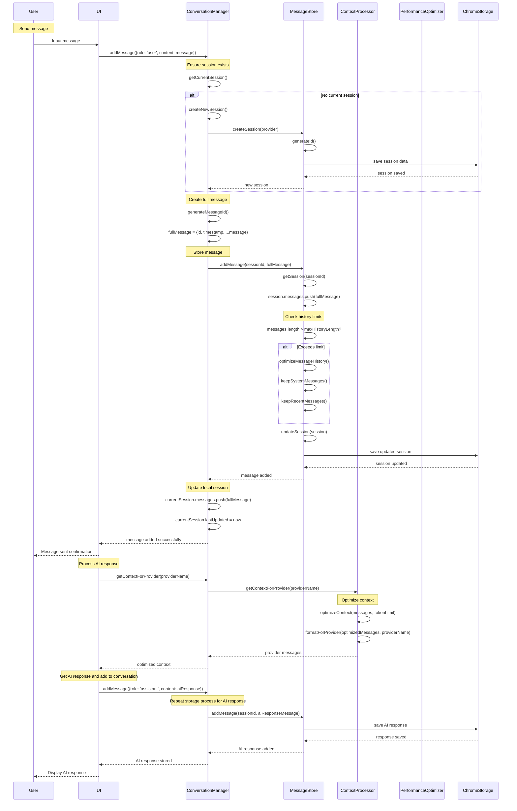
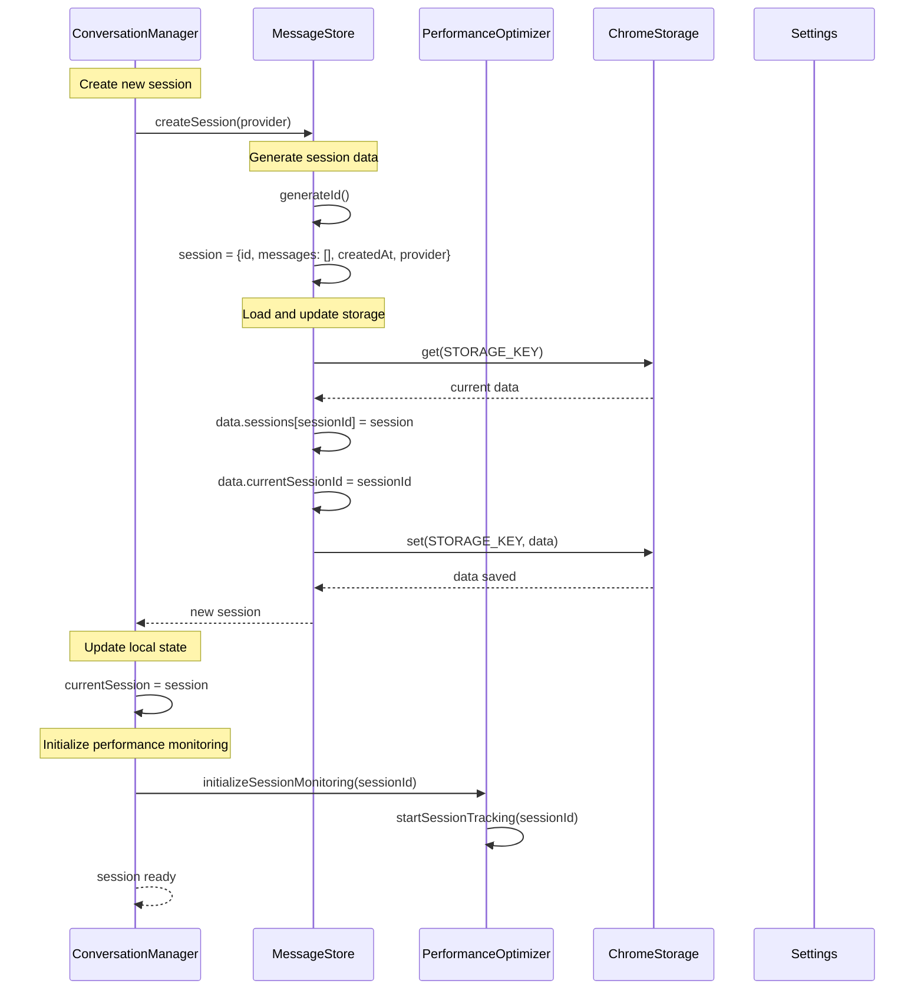
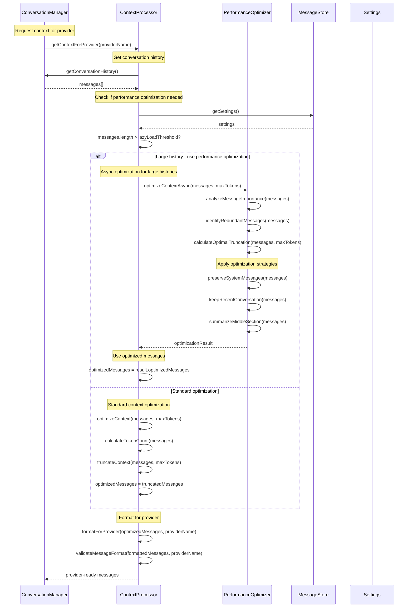
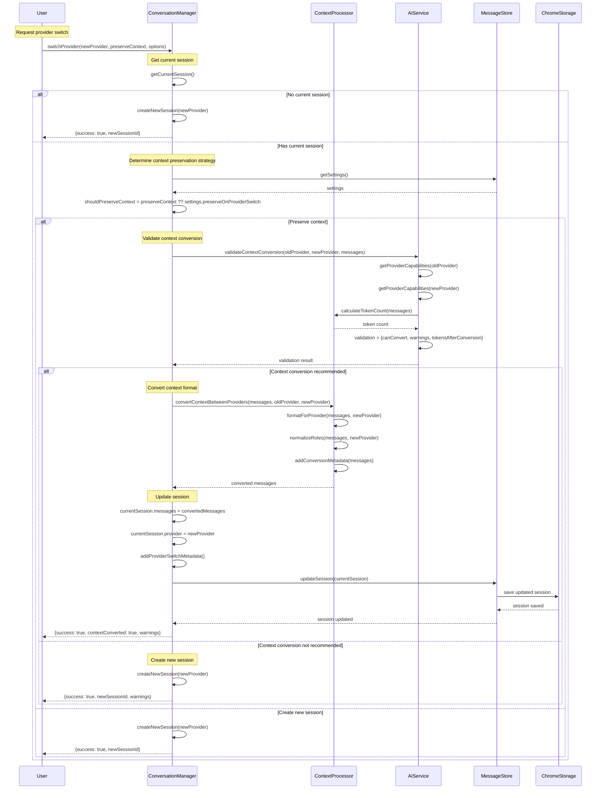
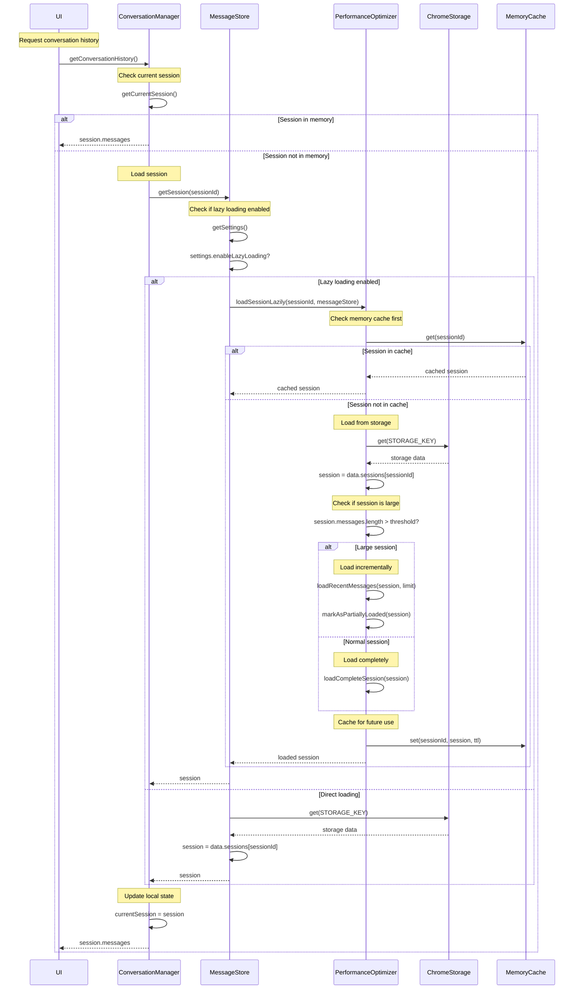
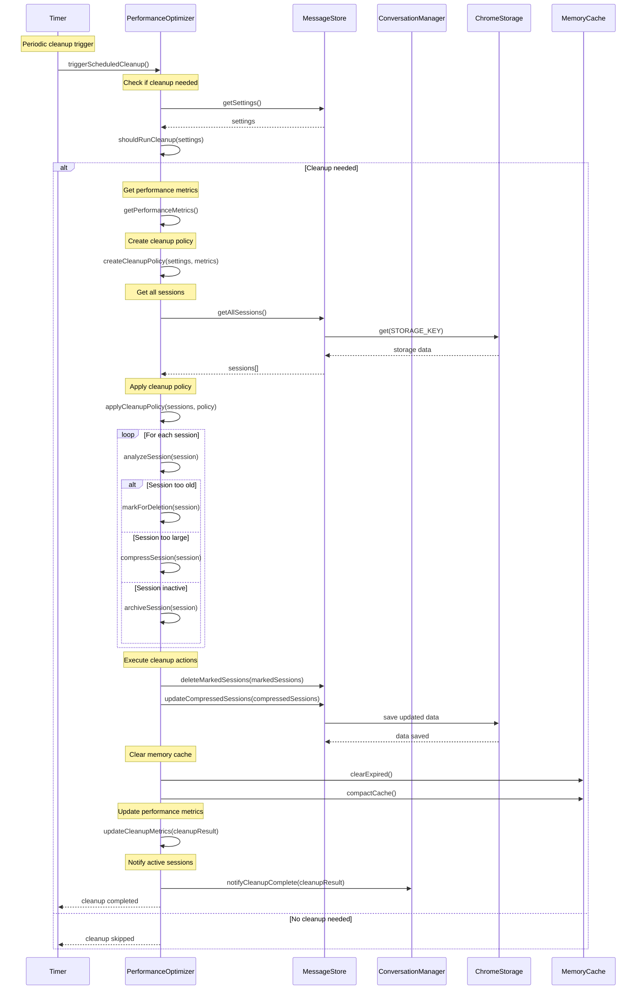
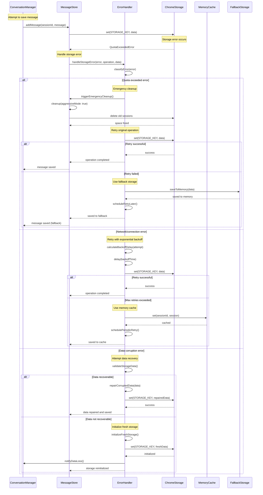
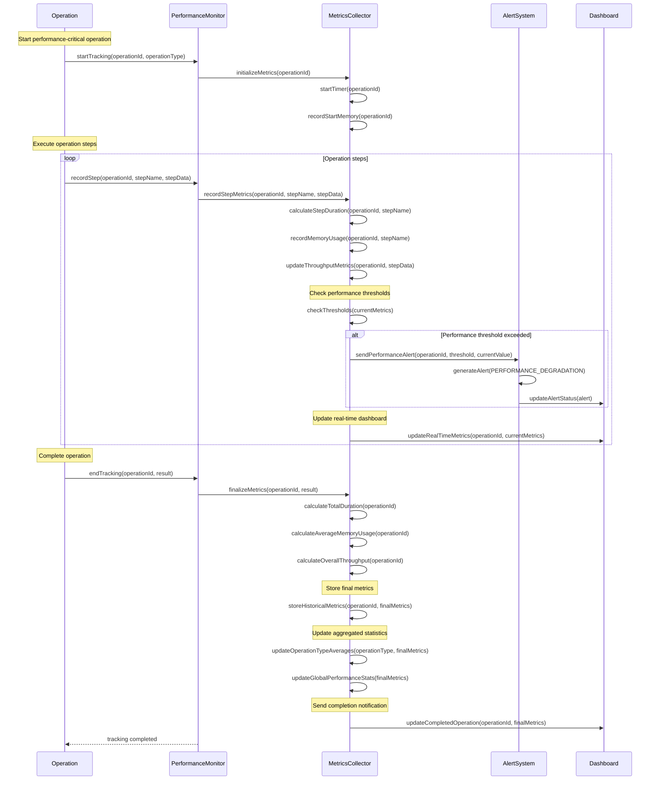
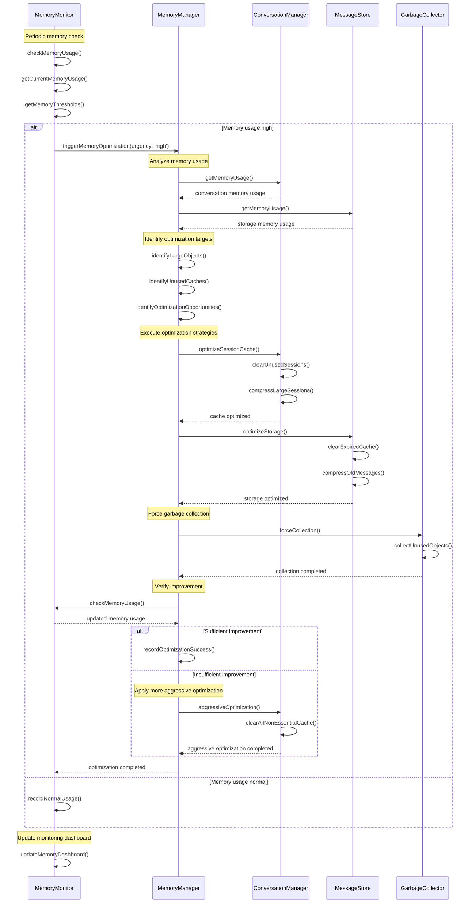

# Conversation Management System - Sequence Diagrams

This document contains detailed sequence diagrams showing the interaction patterns within the Conversation Management System.

## Message Lifecycle Sequences

### Complete Message Processing Flow



### Session Creation and Management



## Context Processing Sequences

### Context Optimization for Large Histories



### Provider Switching with Context Conversion



## Performance Optimization Sequences

### Lazy Loading Implementation



### Background Cleanup Process



## Error Recovery Sequences

### Storage Error Recovery



### Context Processing Error Recovery

```mermaid
sequenceDiagram
    participant ConversationManager
    participant ContextProcessor
    participant ErrorHandler
    participant AIService
    participant FallbackProcessor
    
    Note over ConversationManager: Request context processing
    ConversationManager->>ContextProcessor: getContextForProvider(providerName)
    
    Note over ContextProcessor: Process messages
    ContextProcessor->>ContextProcessor: optimizeContext(messages, maxTokens)
    
    Note over ContextProcessor: Error during processing
    ContextProcessor->>ErrorHandler: handleContextError(error, messages, provider)
    
    ErrorHandler->>ErrorHandler: analyzeContextError(error)
    
    alt Token limit exceeded error
        Note over ErrorHandler: Apply aggressive optimization
        ErrorHandler->>ContextProcessor: aggressiveOptimization(messages, reducedTokens)
        
        ContextProcessor->>ContextProcessor: truncateToEssentials(messages)
        ContextProcessor->>ContextProcessor: removeNonEssentialMetadata(messages)
        ContextProcessor->>ContextProcessor: compressLongMessages(messages)
        
        ContextProcessor-->>ErrorHandler: aggressively optimized messages
        
        ErrorHandler->>ContextProcessor: formatForProvider(optimizedMessages, provider)
        
        alt Aggressive optimization successful
            ContextProcessor-->>ErrorHandler: formatted messages
            ErrorHandler-->>ConversationManager: recovered context
        else Still exceeds limits
            Note over ErrorHandler: Use minimal context
            ErrorHandler->>ErrorHandler: createMinimalContext(messages)
            ErrorHandler-->>ConversationManager: minimal context + warning
        end
        
    else Message format error
        Note over ErrorHandler: Attempt format correction
        ErrorHandler->>ContextProcessor: correctMessageFormat(messages, provider)
        
        ContextProcessor->>ContextProcessor: sanitizeMessages(messages)
        ContextProcessor->>ContextProcessor: normalizeRoles(messages)
        ContextProcessor->>ContextProcessor: validateStructure(messages)
        
        alt Format correction successful
            ContextProcessor-->>ErrorHandler: corrected messages
            ErrorHandler->>ContextProcessor: formatForProvider(correctedMessages, provider)
            ContextProcessor-->>ErrorHandler: formatted messages
            ErrorHandler-->>ConversationManager: corrected context
        else Format correction failed
            Note over ErrorHandler: Use fallback processor
            ErrorHandler->>FallbackProcessor: processWithFallback(messages, provider)
            FallbackProcessor-->>ErrorHandler: fallback processed messages
            ErrorHandler-->>ConversationManager: fallback context + warning
        end
        
    else Provider-specific error
        Note over ErrorHandler: Try alternative provider format
        ErrorHandler->>AIService: getAlternativeProviders(currentProvider)
        AIService-->>ErrorHandler: alternative providers
        
        loop For each alternative provider
            ErrorHandler->>ContextProcessor: formatForProvider(messages, alternativeProvider)
            
            alt Format successful
                ContextProcessor-->>ErrorHandler: formatted messages
                ErrorHandler-->>ConversationManager: alternative format + provider suggestion
                break
            else Format failed
                Note over ErrorHandler: Try next alternative
            end
        end
        
        alt No alternatives worked
            ErrorHandler->>ErrorHandler: useGenericFormat(messages)
            ErrorHandler-->>ConversationManager: generic format + error details
        end
    end
```

## Performance Monitoring Sequences

### Real-time Performance Tracking



### Memory Usage Optimization



These sequence diagrams provide comprehensive views of the Conversation Management System's interaction patterns, showing how components coordinate to provide efficient message handling, context processing, performance optimization, and error recovery.