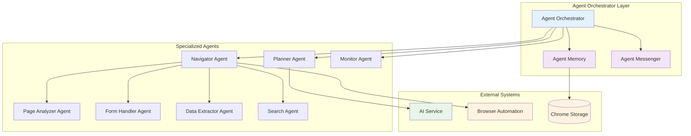
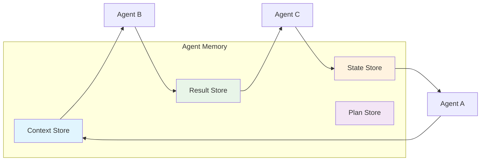
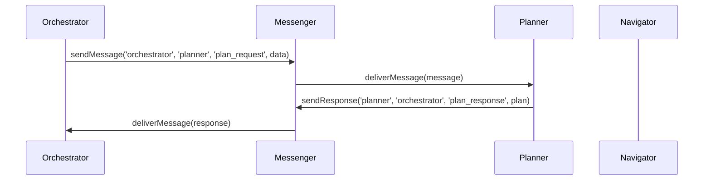
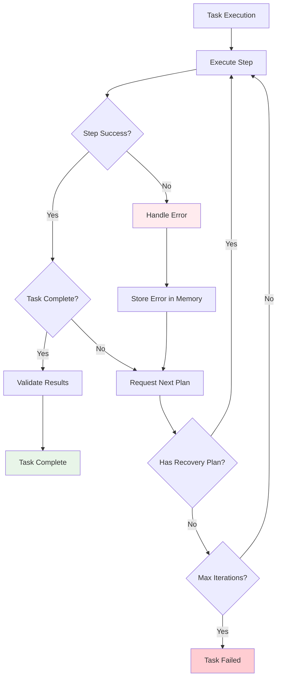
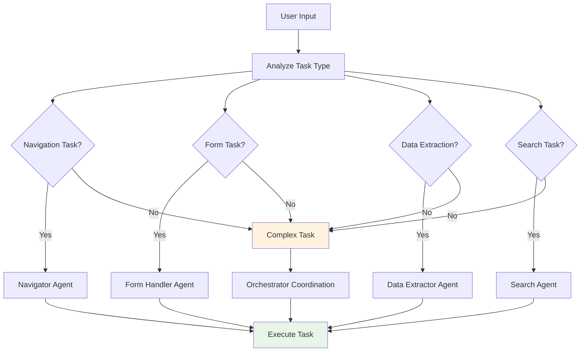
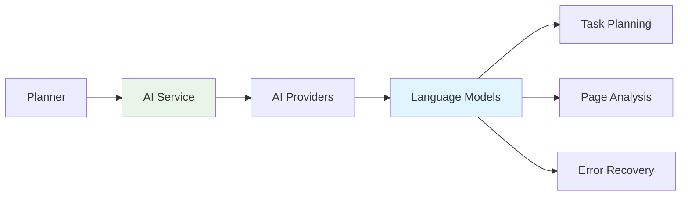
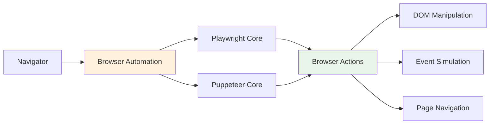
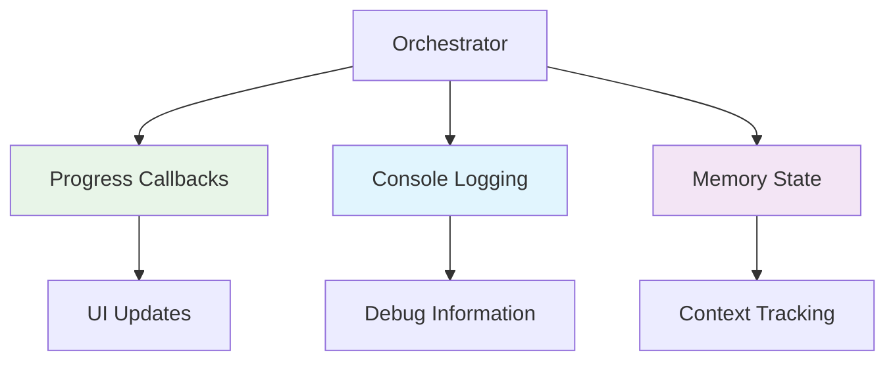

# Multi-Agent Automation System

The Multi-Agent Automation System is the core orchestration engine that coordinates multiple specialized AI agents to perform complex web automation tasks. It provides intelligent task planning, execution monitoring, and error recovery.

## System Overview

The system follows a hierarchical agent architecture where a central orchestrator manages specialized agents, each responsible for specific automation capabilities.

### Core Components

1. **Agent Orchestrator** - Central coordination and task management
2. **Agent Memory** - Shared memory system for inter-agent communication
3. **Specialized Agents** - Task-specific automation agents
4. **Agent Messenger** - Message passing between agents

## Architecture Diagram



## Component Details

### Agent Orchestrator
- **Purpose**: Central coordination of all automation tasks
- **Responsibilities**: Task planning, agent coordination, progress monitoring
- **Key Methods**: `executeTask()`, `executeIteratively()`, `stopCurrentTask()`

### Agent Memory
- **Purpose**: Shared memory system for agent communication and context preservation
- **Features**: Conversation history, result caching, state management
- **Storage Types**: Context, Result, State, Plan

### Specialized Agents
Each agent handles specific automation capabilities:

- **Planner Agent**: Creates execution plans from user input
- **Navigator Agent**: Executes browser automation steps
- **Monitor Agent**: Validates results and monitors execution
- **Page Analyzer Agent**: Analyzes page structure and content
- **Form Handler Agent**: Specialized form interaction handling
- **Data Extractor Agent**: Extracts structured data from pages
- **Search Agent**: Handles search operations and result processing

## Task Execution Flow

```mermaid
sequenceDiagram
    participant User
    participant Orchestrator
    participant Memory
    participant Planner
    participant Navigator
    participant Monitor
    
    User->>Orchestrator: executeTask(userInput)
    Orchestrator->>Memory: remember('currentTask', userInput)
    Orchestrator->>Planner: createPlan(userInput)
    Planner-->>Orchestrator: TaskPlan
    
    loop For each iteration (max 20)
        Orchestrator->>Planner: createPlan(context)
        Planner-->>Orchestrator: TaskStep[]
        
        alt Has steps to execute
            Orchestrator->>Navigator: executeStep(step)
            Navigator-->>Orchestrator: StepResult
            Orchestrator->>Memory: remember(result)
            
            alt Task complete
                break Exit loop
            end
        else No more steps
            break Task complete
        end
    end
    
    Orchestrator->>Monitor: validateResult(results)
    Monitor-->>Orchestrator: ValidationResult
    Orchestrator-->>User: AutomationResult
```

## Agent Communication Patterns

### Memory-Based Communication
Agents share information through the centralized memory system:



### Message Passing
Direct communication between agents using the messenger system:



## Error Recovery Workflow



## Agent Decision Trees

### Task Routing Decision Tree



## Performance Optimization

### Iterative Execution Strategy
The system uses an iterative approach to handle complex tasks:

1. **Dynamic Planning**: Plans are created iteratively based on current context
2. **Context Preservation**: Previous results inform future planning
3. **Early Termination**: Tasks complete when success conditions are met
4. **Error Resilience**: Errors are treated as context for replanning

### Memory Management
- **Conversation Context**: Maintains dialogue history for context-aware planning
- **Result Caching**: Stores intermediate results for reference
- **State Persistence**: Preserves execution state across iterations
- **Cleanup Policies**: Automatic memory cleanup based on age and relevance

## Integration Points

### AI Service Integration


### Browser Automation Integration


## Configuration and Extensibility

### Adding New Agents
To add a new specialized agent:

1. Implement the agent interface
2. Register with the orchestrator
3. Define agent-specific capabilities
4. Integrate with the memory system

### Customizing Execution Flow
The orchestrator supports customization through:
- **Callback Functions**: Progress monitoring and step-by-step control
- **Configuration Options**: Timeout settings, retry policies
- **Agent Selection**: Dynamic agent routing based on task requirements

## Monitoring and Debugging

### Execution Monitoring


### Debug Information
- **Task Progress**: Real-time execution status
- **Agent Communication**: Message passing logs
- **Memory State**: Current context and results
- **Error Details**: Comprehensive error information

## Best Practices

1. **Task Decomposition**: Break complex tasks into manageable steps
2. **Context Management**: Maintain relevant context without overwhelming the system
3. **Error Handling**: Implement graceful degradation and recovery
4. **Performance Monitoring**: Track execution time and resource usage
5. **Agent Coordination**: Use appropriate communication patterns for different scenarios

## Related Documentation

- [AI Provider Architecture](../ai-provider-architecture/README.md)
- [Conversation Management System](../conversation-management/README.md)
- [Browser Automation Architecture](../../browser-automation-architecture.md)