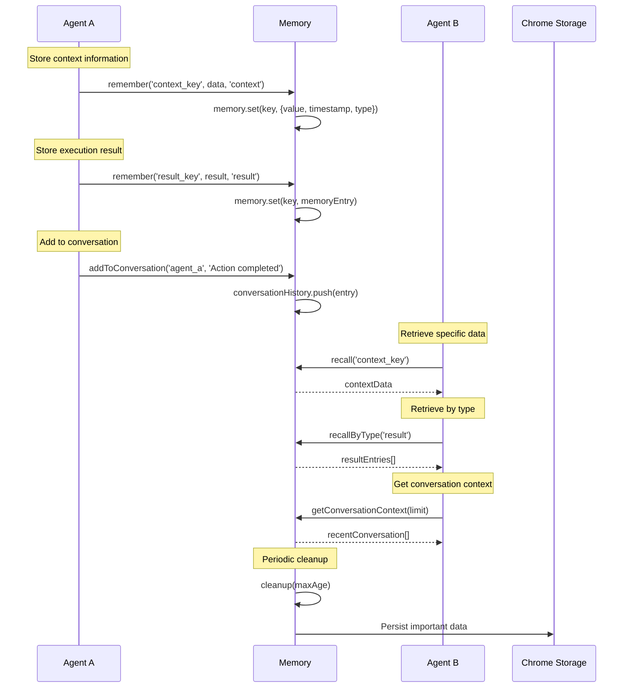
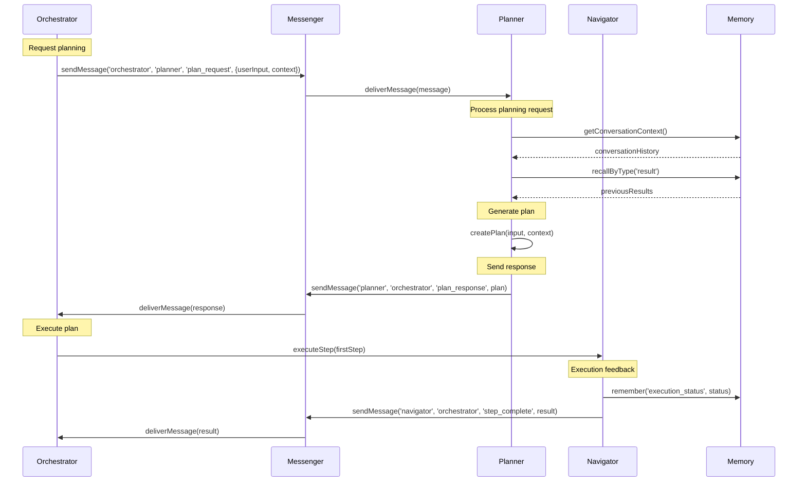
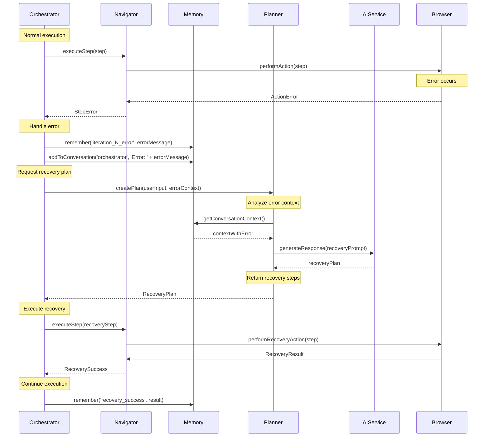
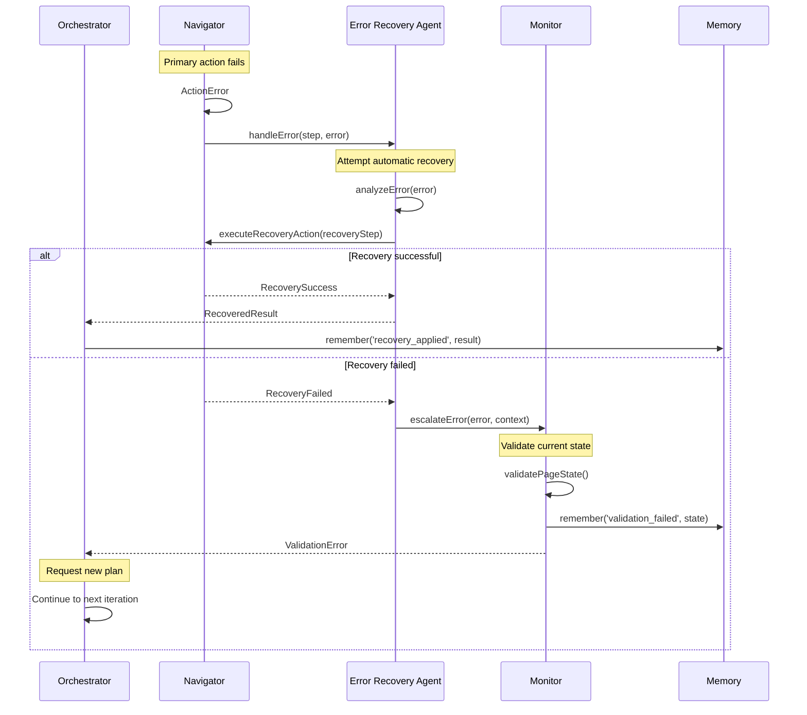
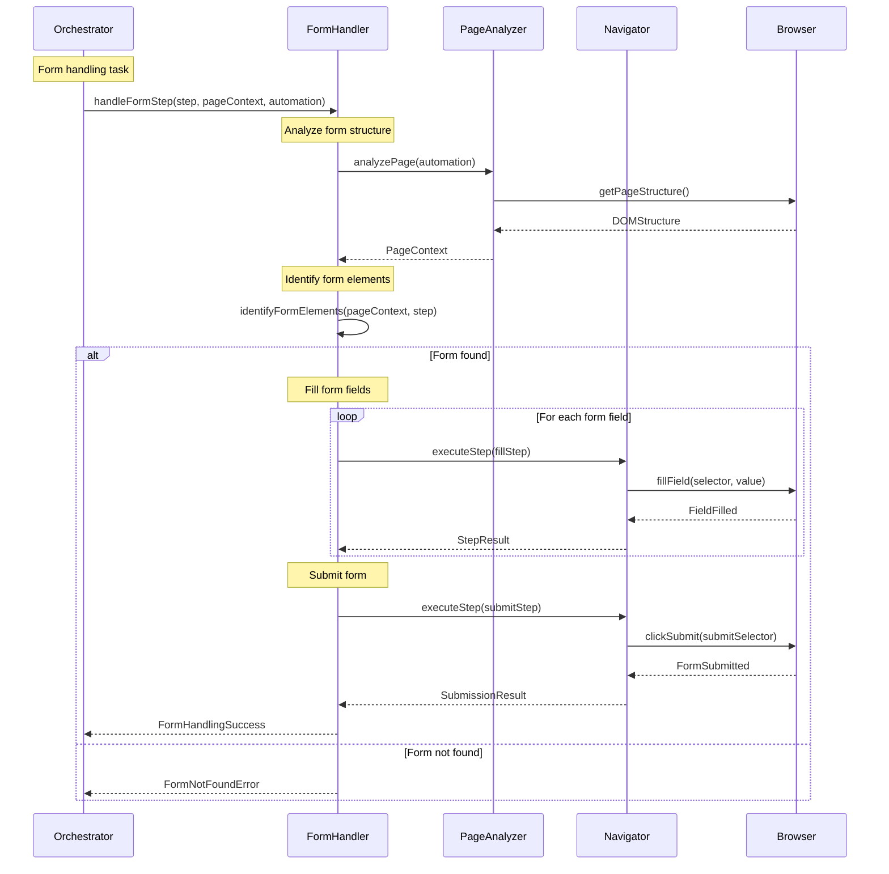
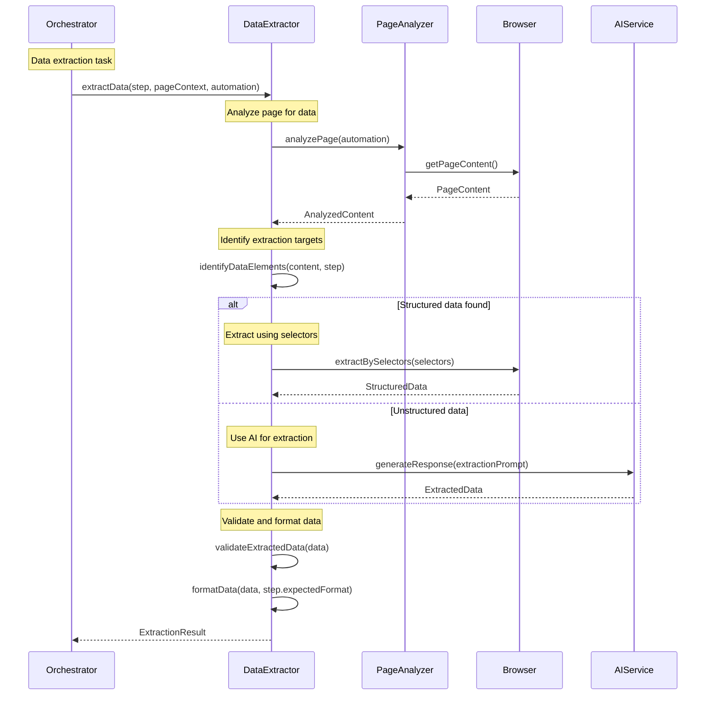
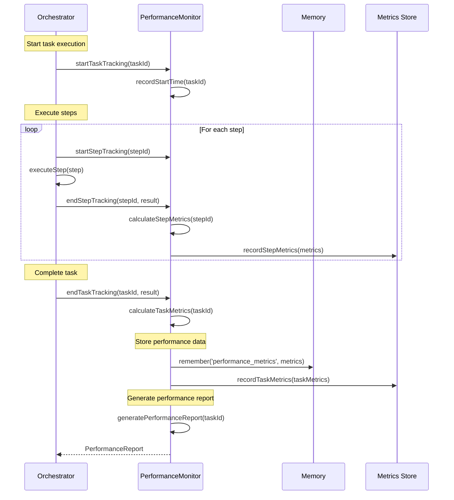
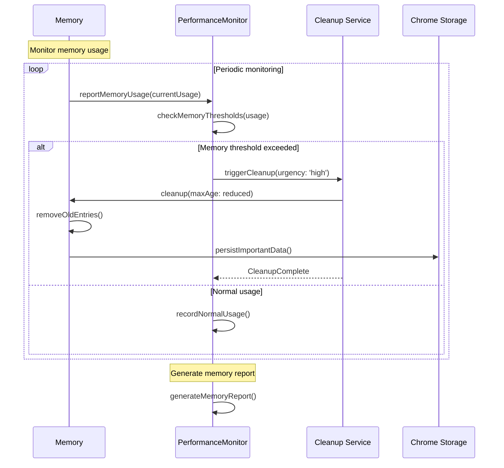
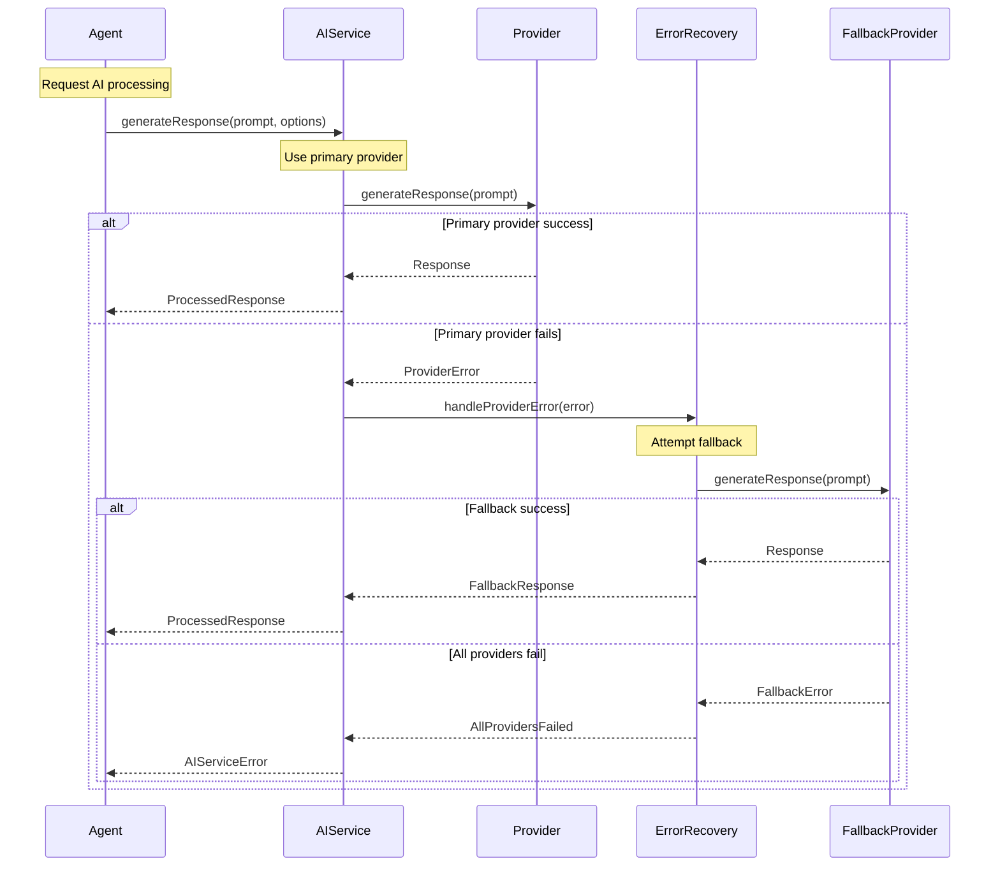
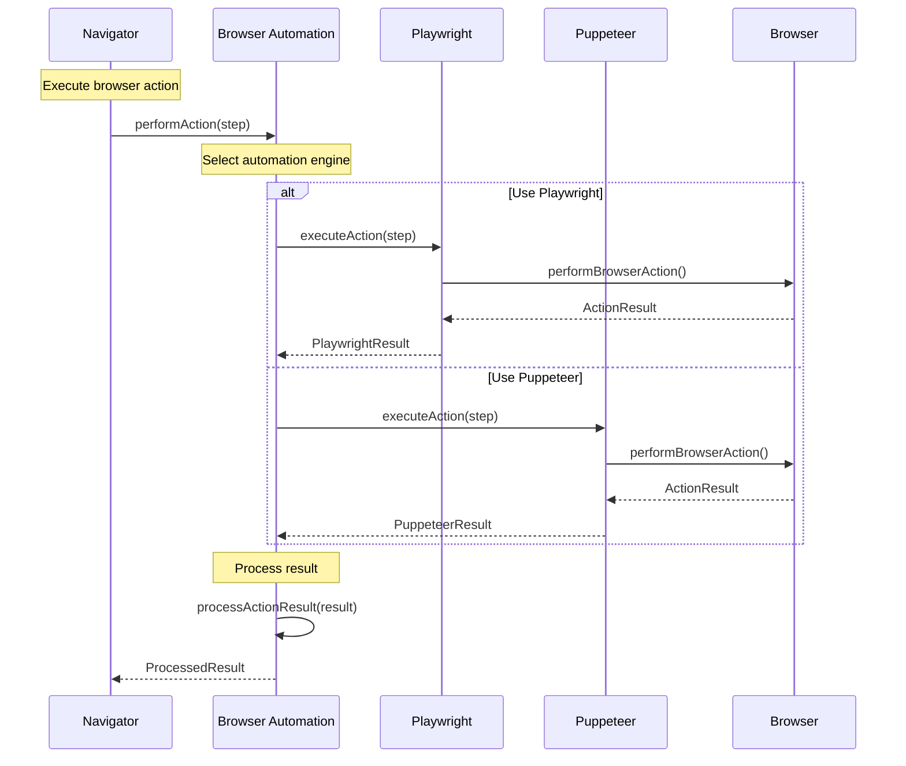

# Multi-Agent Automation System - Sequence Diagrams

This document contains detailed sequence diagrams showing the interaction patterns within the Multi-Agent Automation System.

## Task Execution Lifecycle

### Complete Task Execution Flow

```mermaid
sequenceDiagram
    participant User
    participant UI
    participant Orchestrator
    participant Memory
    participant Messenger
    participant Planner
    participant Navigator
    participant Monitor
    participant AIService
    participant Browser
    
    User->>UI: Request automation task
    UI->>Orchestrator: executeTask(userInput, callbacks)
    
    Note over Orchestrator: Initialize execution state
    Orchestrator->>Orchestrator: isExecuting = true
    Orchestrator->>Memory: remember('currentTask', userInput)
    Orchestrator->>Memory: addToConversation('user', userInput)
    
    Note over Orchestrator: Start conversation
    Orchestrator->>Messenger: startConversation(taskId)
    
    Note over Orchestrator: Initialize agents
    Orchestrator->>Planner: initialize()
    Orchestrator->>Navigator: initialize()
    Orchestrator->>Monitor: initialize()
    
    Note over Orchestrator: Phase 1 - Planning
    Orchestrator->>UI: updateProgress({stage: 'planning'})
    Orchestrator->>Messenger: sendMessage('orchestrator', 'planner', 'plan_request', data)
    Orchestrator->>Planner: createPlan(userInput)
    
    Planner->>AIService: generateResponse(planningPrompt)
    AIService-->>Planner: planResponse
    Planner-->>Orchestrator: TaskPlan
    
    Orchestrator->>Memory: remember('currentPlan', plan)
    Orchestrator->>Memory: addToConversation('planner', planSummary)
    Orchestrator->>UI: onPlanCreated(plan.steps)
    
    Note over Orchestrator: Phase 2 - Iterative Execution
    Orchestrator->>UI: updateProgress({stage: 'executing'})
    
    loop Iterative Execution (max 20 iterations)
        Note over Orchestrator: Get next plan based on context
        Orchestrator->>Planner: createPlan(userInput, context)
        Planner->>AIService: generateResponse(contextualPrompt)
        AIService-->>Planner: nextStepPlan
        Planner-->>Orchestrator: TaskPlan
        
        alt Has steps to execute
            Note over Orchestrator: Execute first step
            Orchestrator->>UI: onStepStart(iteration, step)
            Orchestrator->>Navigator: executeStep(step)
            
            Navigator->>Browser: performAction(step)
            Browser-->>Navigator: actionResult
            Navigator-->>Orchestrator: stepResult
            
            Orchestrator->>Memory: remember(iterationResult, result)
            Orchestrator->>Memory: addToConversation('orchestrator', stepSummary)
            Orchestrator->>UI: onStepComplete(iteration, step, result)
            
            alt Task completion check
                Orchestrator->>Orchestrator: isTaskComplete(step, result)
                Note over Orchestrator: Break if complete
            end
        else No more steps
            Note over Orchestrator: Task complete - no more steps
            break
        end
        
        alt Error occurred
            Orchestrator->>Memory: remember(iterationError, error)
            Orchestrator->>Memory: addToConversation('orchestrator', errorMessage)
            Orchestrator->>UI: onStepError(iteration, step, error)
            Note over Orchestrator: Continue to next iteration for recovery
        end
    end
    
    Note over Orchestrator: Phase 3 - Validation
    Orchestrator->>UI: updateProgress({stage: 'validating'})
    Orchestrator->>Monitor: validateResult(results)
    Monitor-->>Orchestrator: ValidationResult
    
    Note over Orchestrator: Finalize execution
    Orchestrator->>Orchestrator: isExecuting = false
    Orchestrator-->>UI: AutomationResult
    UI-->>User: Task completion notification
```

## Agent Memory Interaction Patterns

### Memory Storage and Retrieval



### Cross-Agent Communication



## Error Recovery Sequences

### Error Detection and Recovery



### Cascading Error Handling



## Specialized Agent Workflows

### Form Handler Agent Sequence



### Data Extractor Agent Sequence



## Performance Monitoring Sequences

### Execution Performance Tracking



### Memory Usage Monitoring



## Integration Sequences

### AI Service Integration



### Browser Automation Integration



These sequence diagrams provide detailed views of how components interact within the Multi-Agent Automation System, showing the flow of data, error handling, and coordination patterns that enable complex web automation tasks.