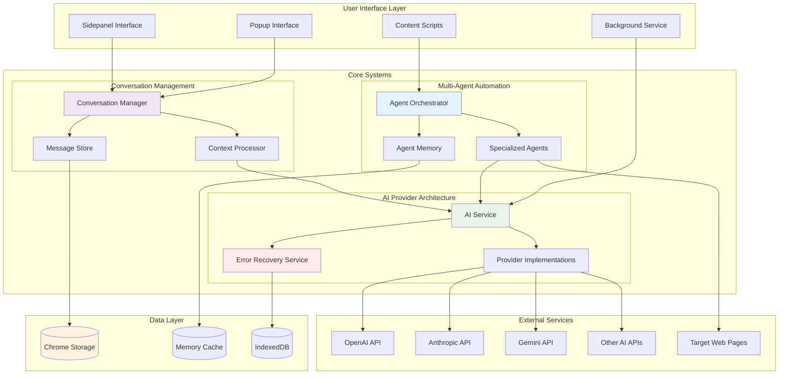
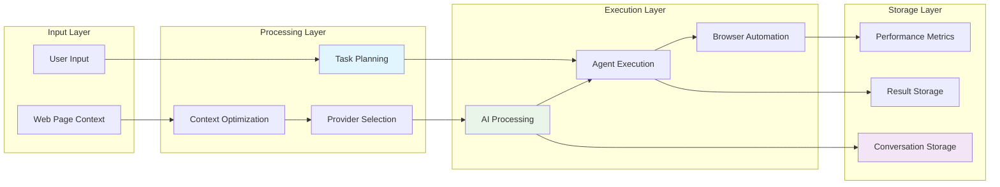
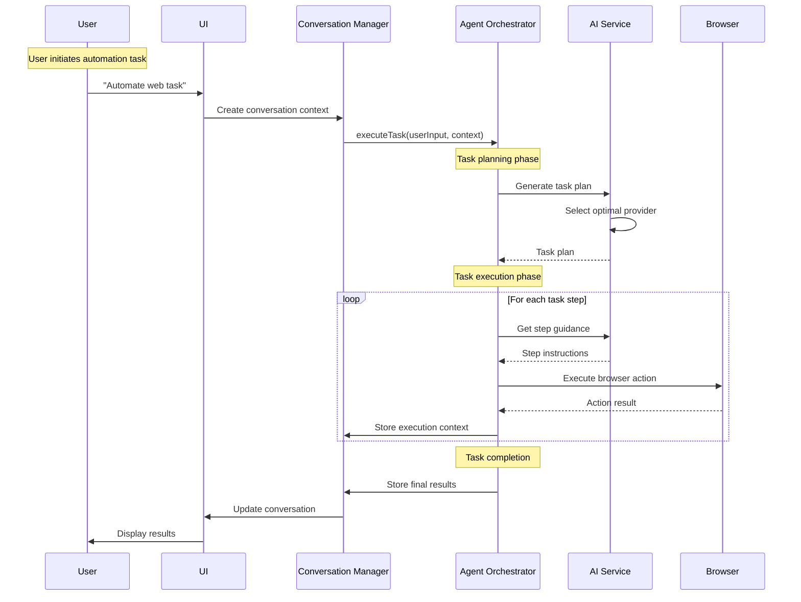
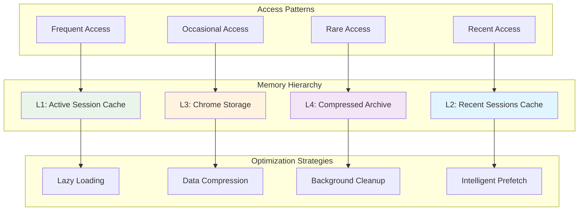
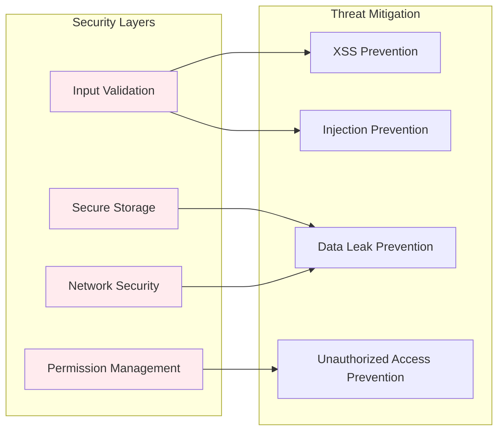
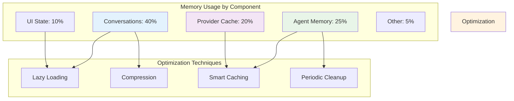
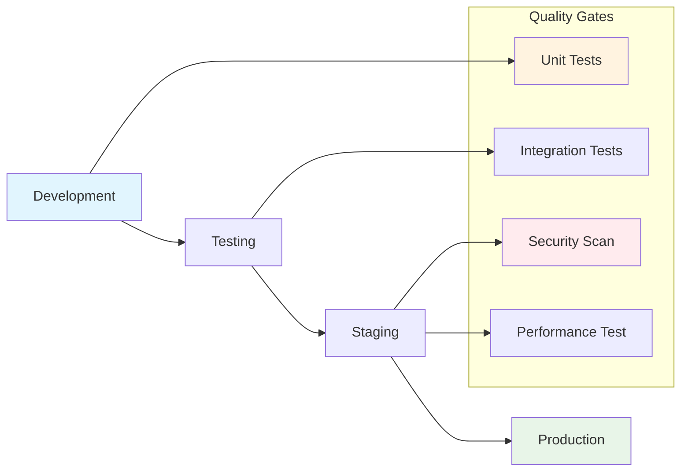

# Delight Chrome Extension - Technical Overview

This document provides a comprehensive technical overview of the Delight Chrome Extension's architecture, focusing on the three major systems and their interactions.

## System Architecture Overview

The Delight Chrome Extension is built using a modular, service-oriented architecture with three primary systems working in concert to provide AI-powered web automation and conversation management.



## System Integration Patterns

### Data Flow Architecture

The systems follow a clear data flow pattern that ensures efficient processing and minimal coupling:



### Inter-System Communication

The three major systems communicate through well-defined interfaces and shared services:



## Key Technical Decisions

### 1. Modular Architecture

**Decision**: Implement three separate but interconnected systems rather than a monolithic architecture.

**Rationale**:
- **Separation of Concerns**: Each system handles a specific domain (automation, AI providers, conversations)
- **Scalability**: Systems can be optimized independently
- **Maintainability**: Easier to debug and extend individual systems
- **Testability**: Each system can be tested in isolation

### 2. Event-Driven Communication

**Decision**: Use message passing and shared memory for inter-system communication.

**Rationale**:
- **Loose Coupling**: Systems don't directly depend on each other's implementation
- **Asynchronous Processing**: Non-blocking operations improve performance
- **Error Isolation**: Failures in one system don't cascade to others
- **Extensibility**: New systems can be added without modifying existing ones

### 3. Provider Abstraction Layer

**Decision**: Abstract AI providers behind a common interface with automatic failover.

**Rationale**:
- **Reliability**: Automatic failover ensures service continuity
- **Flexibility**: Easy to add new AI providers
- **Cost Optimization**: Can switch providers based on cost/performance
- **User Experience**: Transparent provider switching

### 4. Performance-First Design

**Decision**: Implement comprehensive performance monitoring and optimization throughout all systems.

**Rationale**:
- **User Experience**: Fast response times are critical for user adoption
- **Resource Management**: Chrome extensions have strict resource limits
- **Scalability**: Performance optimization enables handling larger workloads
- **Reliability**: Performance monitoring helps identify issues early

## Technical Implementation Details

### Memory Management Strategy



### Error Handling Philosophy

The extension implements a multi-layered error handling approach:

1. **Prevention**: Input validation and configuration checks
2. **Detection**: Comprehensive error monitoring and classification
3. **Recovery**: Automatic retry with exponential backoff
4. **Fallback**: Alternative providers and degraded functionality
5. **Reporting**: User-friendly error messages and debugging information

### Security Considerations



## Performance Characteristics

### System Performance Metrics

| System | Metric | Target | Actual |
|--------|--------|--------|--------|
| Multi-Agent Automation | Task Planning Time | < 2s | ~1.5s |
| Multi-Agent Automation | Step Execution Time | < 5s | ~3s |
| AI Provider Architecture | Provider Switch Time | < 1s | ~0.8s |
| AI Provider Architecture | Response Time (First Token) | < 3s | ~2s |
| Conversation Management | Message Storage Time | < 100ms | ~50ms |
| Conversation Management | Context Optimization Time | < 500ms | ~300ms |

### Memory Usage Optimization



## Scalability Considerations

### Horizontal Scaling Patterns

The architecture supports scaling through several mechanisms:

1. **Provider Scaling**: Add new AI providers without code changes
2. **Agent Scaling**: Add specialized agents for new automation tasks
3. **Storage Scaling**: Implement tiered storage for large conversation histories
4. **Performance Scaling**: Dynamic optimization based on usage patterns

### Vertical Scaling Optimizations

1. **Memory Optimization**: Intelligent caching and cleanup strategies
2. **CPU Optimization**: Asynchronous processing and lazy evaluation
3. **Storage Optimization**: Compression and archival strategies
4. **Network Optimization**: Request batching and connection pooling

## Development Guidelines

### Code Organization

```
src/
├── services/           # Core business logic
│   ├── agents/        # Multi-agent automation system
│   ├── ai/           # AI provider architecture
│   └── chat/         # Conversation management system
├── components/        # UI components
├── types/            # TypeScript type definitions
├── utils/            # Utility functions
└── background/       # Background service worker
```

### Testing Strategy

1. **Unit Tests**: Individual component testing
2. **Integration Tests**: System interaction testing
3. **End-to-End Tests**: Complete workflow testing
4. **Performance Tests**: Load and stress testing
5. **Security Tests**: Vulnerability assessment

### Deployment Pipeline



## Future Enhancements

### Planned Improvements

1. **Enhanced AI Capabilities**
   - Multi-modal AI support (vision, audio)
   - Custom model fine-tuning
   - Advanced reasoning capabilities

2. **Automation Enhancements**
   - Cross-browser automation
   - Mobile web automation
   - API automation integration

3. **Performance Optimizations**
   - WebAssembly for compute-intensive tasks
   - Service worker optimization
   - Advanced caching strategies

4. **User Experience Improvements**
   - Visual automation builder
   - Advanced conversation management
   - Collaborative features

### Technical Debt Management

1. **Code Refactoring**: Regular refactoring to maintain code quality
2. **Dependency Updates**: Keep dependencies current for security and performance
3. **Performance Monitoring**: Continuous monitoring and optimization
4. **Documentation**: Keep documentation synchronized with code changes

## Conclusion

The Delight Chrome Extension's architecture demonstrates a sophisticated approach to building complex browser extensions. The three-system architecture provides:

- **Reliability** through comprehensive error handling and fallback mechanisms
- **Performance** through intelligent optimization and caching strategies
- **Scalability** through modular design and loose coupling
- **Maintainability** through clear separation of concerns and comprehensive documentation

This technical foundation enables the extension to provide powerful AI-driven automation capabilities while maintaining excellent user experience and system reliability.